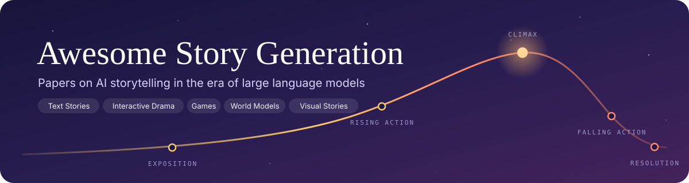
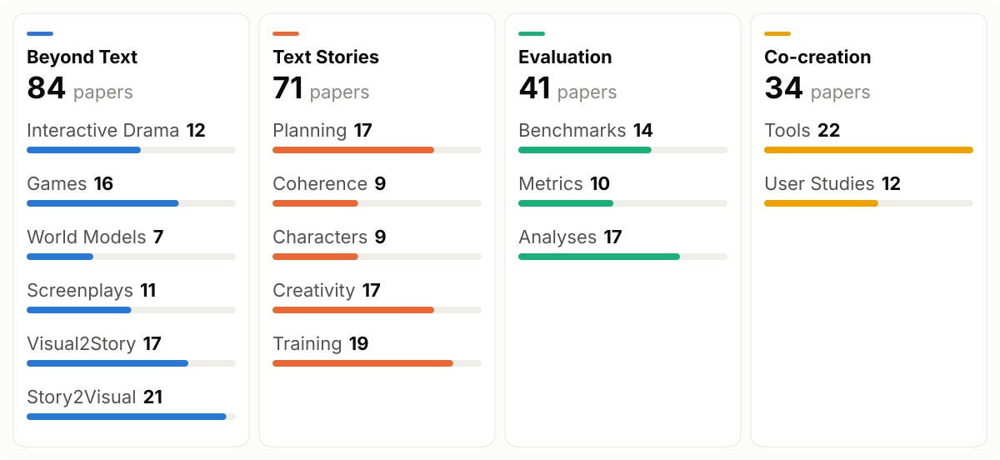
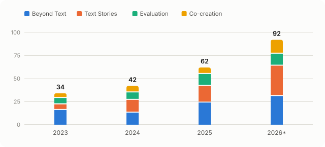

<p align="center">
  
</p>

<p align="center">
  <a href="https://awesome.re"></a>
  
  <a href="https://github.com/yingpengma/Awesome-Story-Generation/commits/main"></a>
  <a href="https://github.com/yingpengma/Awesome-Story-Generation/stargazers"></a>
  <a href="CONTRIBUTING.md"></a>
  <a href="LICENSE"></a>
</p>

<p align="center">
  <a href="#news"></a>
  <a href="#overview"></a>
  <a href="#papers"></a>
  <a href="#contributing"></a>
  <a href="#citation"></a>
</p>

<div align="center">Maintained by <a href="https://yingpengma.github.io/">Yingpeng Ma</a> and <a href="https://mantle2048.github.io/">Yan Ma</a></div>

<br>

A curated list of papers on **story generation and storytelling in the era of large language models**: long-form fiction, screenplays and drama, games, narrative world models, visual stories, and how to evaluate and co-create them. Every paper comes with a one-line summary, and papers we consider essential reading are marked with 🌟.

**Thank you for the stars!** Contributions are very welcome: open an issue or PR for missing papers or mistakes. Contact: `mayingpeng33 [AT] gmail [DOT] com`

<a id="news"></a>

## 📰 News

- **[2026-09]** 🎉 **Major update:** 234 papers, a new taxonomy, one-line summaries and 🌟 must-read picks.
- **[2026-05]** 🔥 Our paper on long-horizon consistency in interactive narratives is accepted to **ICML 2026**! [See it here.](#interactive-drama)

<a id="overview"></a>

## 🗺️ Overview

<picture>
  <source media="(prefers-color-scheme: dark)" srcset="assets/overview-dark.svg">
  
</picture>

- **Beyond Text**: interactive drama, games, narrative world models, screenplays, and visual stories.
- **Text Stories**: planning, coherence, characters, creativity, and training for written stories.
- **Evaluation**: benchmarks, metrics, and analyses of written stories.
- **Co-creation**: tools for creators, and studies of how people write with AI.
- **Surveys**: overviews of the whole field.

Each paper appears exactly once. Human-centered systems and studies go to Co-creation; work on other media goes to Beyond Text (including its evaluation); remaining work on written stories goes to Evaluation or to the Text Stories topic it mainly addresses. Visual work is included only when it operates at the story level (plot, script, shot planning, narrative reasoning), not when it only improves rendering quality or character consistency. Within a section, papers are sorted by year, with 🌟 must-reads first.

<p align="center">
<picture>
  <source media="(prefers-color-scheme: dark)" srcset="assets/papers-by-year-dark.svg">
  
</picture>
</p>

<details>
<summary>Data table for the chart (2026 counts through September; the 4 surveys are not shown)</summary>

| Year | Beyond Text | Text Stories | Evaluation | Co-creation | Total |
|---|---|---|---|---|---|
| 2023 | 16 | 6 | 7 | 5 | 34 |
| 2024 | 13 | 14 | 8 | 7 | 42 |
| 2025 | 24 | 18 | 13 | 7 | 62 |
| 2026* | 31 | 33 | 13 | 15 | 92 |

</details>

## 📑 Table of Contents

- [📰 News](#news)
- [🗺️ Overview](#overview)
- [📄 Papers](#papers)
  - [🎭 Beyond Text](#beyond-text)
    - [🎪 Interactive Drama](#interactive-drama) (12)
    - [🎲 Games](#games) (16)
    - [🌐 World Models](#world-models) (7)
    - [🎞️ Screenplays](#screenplays) (11)
    - [🖼️ Visual2Story](#visual2story) (17)
    - [🌄 Story2Visual](#story2visual) (21)
  - [✍️ Text Stories](#text-stories)
    - [🗺️ Planning](#planning) (17)
    - [🧵 Coherence](#coherence) (9)
    - [🧑‍🤝‍🧑 Characters](#characters) (9)
    - [🎨 Creativity](#creativity) (17)
    - [🎯 Training](#training) (19)
  - [📏 Evaluation](#evaluation)
    - [🧪 Benchmarks](#benchmarks) (14)
    - [📐 Metrics](#metrics) (10)
    - [🔍 Analyses](#analyses) (17)
  - [🤝 Co-creation](#co-creation)
    - [🛠️ Tools](#tools) (22)
    - [👥 User Studies](#user-studies) (12)
  - [📚 Surveys](#surveys) (4)
- [🧰 Public Resources](#public-resources)
- [🤝 Contributing](#contributing)
- [📝 Citation](#citation)

<a id="papers"></a>

## 📄 Papers

**How to read an entry:** venue · citation count (refreshed weekly) · 🌟 must-read · **title** · [paper] · GitHub stars of the official code, when available, followed by authors and a one-line summary.

Venue colors:        

<a id="beyond-text"></a>

### 🎭 Beyond Text

<a id="interactive-drama"></a>

#### 🎪 Interactive Drama

-  []() 🌟 **Can LLM Agents Stick to the Script? A Benchmark for Long-Horizon Consistency in Interactive Narratives** [[paper]](https://arxiv.org/abs/2608.08160) [](https://github.com/NLP2CT/NCP-Bench)<br><sub>Yingpeng Ma, Jianhao Yan, Bei-Ning Shi, Karim Kam, Runnan Wang, Xue-Bo Liu, Yulong Chen, Yue Zhang, Derek F. Wong</sub>
  > Introduces a 100-environment benchmark on whether LLM narrators keep story commitments under user interventions; even GPT-5.2 survives only 42% after 20 turns.
-  []() **NARRA-Gym for Evaluating Interactive Narrative Agents** [[paper]](https://arxiv.org/abs/2605.08503)<br><sub>Yue Huang, Yu-Chen Ma, Jiayi Ye, Wen-Jie Wang, Zi-Peng Ling, Xing Hu, Yuexing Hao, Zi-Chen Chen, Zhangchen Xu, Yun-Hong He, et al.</sub>
  > Introduces an executable environment growing emotional seeds into full interactive story episodes, showing fluent LLMs still fail on robustness and personalization.
-  []() **AdaMARP: An Adaptive Multi-Agent Interaction Framework for General Immersive Role-Playing** [[paper]](https://arxiv.org/abs/2601.11007)<br><sub>Zhenhua Xu, Dongsheng Chen, Shuo Wang, Jian Li, Chengjie Wang, Meng Han, Ya-Biao Wang</sub>
  > Proposes a multi-agent role-play framework whose scene manager selects speakers, switches scenes, and introduces roles, with training data and a benchmark.
-  []() **HAMLET: A Hierarchical and Adaptive Multi-Agent Framework for Live Embodied Theatrics** [[paper]](https://openreview.net/pdf?id=MKwW04UHW1) [](https://github.com/Tsumugii24/HAMLET) [[dataset]](https://huggingface.co/datasets/Tsumugii/HAMLET)<br><sub>Shu-Fan Jiang, Si-Zhou Chen, Chios Chen, Chi Zhang, Xiao-Lei Zhang, Xue-Long Li</sub>
  > Builds HAMLET, a multi-agent framework that turns a topic into a narrative blueprint and performs live embodied theatre with adaptive actor agents.
-  []() 🌟 **Towards Enhanced Immersion and Agency for LLM-based Interactive Drama** [[paper]](https://arxiv.org/abs/2502.17878) [](https://github.com/gingasan/interactive-drama)<br><sub>Hongqiu Wu, Weiqi Wu, Tianyang Xu, Jiameng Zhang, Hai Zhao</sub>
  > Proposes Playwriting-guided Generation and Plot-based Reflection to improve player immersion and agency in LLM-based interactive drama.
-  []() 🌟 **CharacterBox: Evaluating the Role-Playing Capabilities of LLMs in Text-Based Virtual Worlds** [[paper]](https://arxiv.org/abs/2412.05631) [](https://github.com/paitesanshi/characterbox)<br><sub>Lei Wang, Jian-Xun Lian, Yi Huang, Yanqi Dai, Haoxuan Li, Xu Chen, Xing Xie, Ji-Rong Wen</sub>
  > Introduces a simulation sandbox with character and narrator agents that produces behavior trajectories for fine-grained evaluation of LLM role-playing.
-  []() **ProTriPlay: A trinity framework for professional interactive theater based on LLM** [[paper]](https://doi.org/10.1007/s40747-025-02173-4)<br><sub>Yinglong Yu, Hao Shen, Ming Yang, Yu Wang, Yanyu Liu</sub>
  > Builds an LLM interactive theater system with director, screenwriter, and actor agents that adapt the plot to player dialogue and object interactions.
-  []() **CoDi: A Director-Actor Framework for Goal-Driven Interactive Story Generation with LLMs** [[paper]](https://doi.org/10.1609/aiide.v21i1.36811)<br><sub>Honggu Kim, Taewoo Yoo, Yun-Gyung Cheong</sub>
  > Extends the director-actor paradigm so a director agent pursues high-level narrative goals by introducing events, selecting NPCs, and specifying outcomes.
-  []() **OPEN-THEATRE: An Open-Source Toolkit for LLM-based Interactive Drama** [[paper]](https://arxiv.org/abs/2509.16713)<br><sub>Tianyang Xu, Hongqiu Wu, Weiqi Wu, Hai Zhao</sub>
  > Releases Open-Theatre, an open-source toolkit for LLM interactive drama with multi-agent architecture and hierarchical retrieval-based memory for coherent long-term behavior.
-  []() **RolePlot: A Systematic Framework for Evaluating and Enhancing the Plot-Progression Capabilities of Role-Playing Agents** [[paper]](https://aclanthology.org/2025.acl-long.603/)<br><sub>Pinyi Zhang, Si-Yu An, Lingfeng Qiao, Yi-Fei Yu, Jing-Yang Chen, Jie Wang, Di Yin, Xing Sun, Kai Zhang</sub>
  > Proposes a plot-progression dataset and method for role-playing agents, detecting an LLM embedding trigger subspace to prompt timely plot advances.
-  []() 🌟 **From Role-Play to Drama-Interaction: An LLM Solution** [[paper]](https://arxiv.org/abs/2405.14231)<br><sub>Weiqi Wu, Hongqiu Wu, Lai Jiang, Xing-Chen Liu, Jiale Hong, Haizhen Zhao, Min Zhang</sub>
  > Defines LLM-based interactive drama and trains a drama LLM using Narrative Chain control, Auto-Drama script synthesis, and Sparse Instruction Tuning.
-  []() **NarrativePlay: An Automated System for Crafting Visual Worlds in Novels for Role-Playing** [[paper]](https://doi.org/10.1609/aaai.v38i21.30589)<br><sub>Run-Cong Zhao, Wenjia Zhang, Jiazheng Li, Lixing Zhu, Yanran Li, Yulan He, Lin Gui</sub>
  > Presents a demo system that lets users role-play a novel character in LLM-generated narrative environments with generated visuals and speech.

<a id="games"></a>

#### 🎲 Games

-  []() **When Stories Evolve: Benchmarking LLM Storytelling Across Agent Architectures in Open-Ended World Simulations** [[paper]](https://arxiv.org/abs/2608.15654)<br><sub>Yuqi Chen, Sixuan Li, Yunfeng Cai, Xueai Li, Kaiwen Yan, Ying Li</sub>
  > Introduces a process benchmark for storytelling in evolving world simulations, finding generation length, canonical consistency, and narrative richness are distinct, competing capacities.
-  []() **Generating Clue-Driven Investigative Game Narratives with Large Language Models** [[paper]](https://doi.org/10.1145/3815598.3815649)<br><sub>Vikram Kumaran, A. Smith, Wookhee Min, Randall Spain, Bradford W. Mott, James C. Lester</sub>
  > Builds an LLM framework that generates solvable clue-driven investigative 3D game episodes around a deductive solution model guiding characters, clues, and dialogue.
-  []() **IVIE: A Neuro-symbolic Approach to Incremental and Validated Generation of Interactive Fiction Worlds** [[paper]](https://arxiv.org/abs/2606.13348)<br><sub>Micaela Vaucher, Santiago Silveira, Santiago Góngora, Luis Chiruzzo</sub>
  > Generates playable interactive fiction worlds in four incremental stages, letting LLMs make creative choices while symbolic validation keeps world state coherent.
-  []() **Guiding, Not Railroading: Design and Evaluation of a Multi-Agent System for Narrative Redirection in Role-playing Games** [[paper]](https://doi.org/10.1145/3742413.3789218)<br><sub>Nicolai Hejlesen Jørgensen, Sarmilan Tharmabalan, Ilhan Aslan, Nicolai Brodersen Hansen, Timothy Merritt</sub>
  > Builds a multi-agent RPG game master with a narrative graph and tests six redirection strategies; players prefer in-world redirection over hard denials.
-  []() **STORY2GAME: Generating (Almost) Everything in an Interactive Fiction Game** [[paper]](https://arxiv.org/abs/2505.03547)<br><sub>E. Zhou, Shreyas Basavatia, M. Siam, Zexin Chen, Mark O. Riedl</sub>
  > Builds STORY2GAME, which generates a story, populates a world, and writes action code from LLM-derived preconditions and effects for playable interactive fiction.
-  []() **NarrativeGenie: Generating Narrative Beats and Dynamic Storytelling with Large Language Models** [[paper]](https://ojs.aaai.org/index.php/AIIDE/article/view/31868)<br><sub>Vikram Kumaran, Jonathan Rowe, James C. Lester</sub>
  > Builds NarrativeGenie, which turns a designer's story overview into a partially ordered event graph of narrative beats that adapts to player actions.
-  []() **PANGeA: Procedural Artificial Narrative Using Generative AI for Turn-Based, Role-Playing Video Games** [[paper]](https://doi.org/10.1609/aiide.v20i1.31876)<br><sub>Stephanie Buongiorno, Lawrence J. Klinkert, Zixin Zhuang, Tanishq Chawla, Corey Clark</sub>
  > Builds a system with memory, validation, and a Unity plug-in that keeps LLM-generated RPG content consistent with designer rules despite free-form input.
-  []() **Word2World: Generating Stories and Worlds through Large Language Models** [[paper]](https://arxiv.org/abs/2405.06686) [](https://github.com/umair-nasir14/Word2World)<br><sub>Muhammad Umair Nasir, Steven James, Julian Togelius</sub>
  > Builds Word2World, which prompts LLMs to write a story, extract narrative elements, and place tiles to produce playable game worlds without fine-tuning.
-  []() **Generating Role-Playing Game Quests With GPT Language Models** [[paper]](https://doi.org/10.1109/TG.2022.3228480)<br><sub>Susanna Värtinen, Perttu Hämäläinen, C. Guckelsberger</sub>
  > Fine-tunes GPT-2 on a released dataset of 978 RPG quests, finding about one in five generated quest descriptions acceptable to players.
-  []() **Ontologically Faithful Generation of Non-Player Character Dialogues** [[paper]](https://arxiv.org/abs/2212.10618)<br><sub>Nathaniel Weir, Ryan Thomas, Randolph D'Amore, Kellie Hill, Benjamin Van Durme, Harsh Jhamtani</sub>
  > Introduces KNUDGE, a dataset from The Outer Worlds requiring lore-faithful, quest-revealing NPC dialogue trees, with supervised and in-context baselines leaving headroom.
-  []() 🌟 **SceneCraft: Automating Interactive Narrative Scene Generation in Digital Games with Large Language Models** [[paper]](https://ojs.aaai.org/index.php/AIIDE/article/view/27504)<br><sub>Vikram Kumaran, Jonathan Rowe, Bradford W. Mott, James C. Lester</sub>
  > Proposes SceneCraft, an LLM framework that automates NPC interaction scenes to unfold authored plot events in narrative-centered games.
-  []() 🌟 **Language as Reality: A Co-Creative Storytelling Game Experience in 1001 Nights using Generative AI** [[paper]](https://arxiv.org/abs/2308.12915)<br><sub>Yuqian Sun, Zhouyi Li, Ke Fang, Chang Hee Lee, A. Asadipour</sub>
  > Presents 1001 Nights, a game where spoken keywords in co-created LLM tales materialize as in-game items, proposing the notion of AI-native games.
-  []() 🌟 **FIREBALL: A Dataset of Dungeons and Dragons Actual-Play with Structured Game State Information** [[paper]](https://arxiv.org/abs/2305.01528) [](https://github.com/zhudotexe/fireball)<br><sub>Andrew Zhu, Karmanya Aggarwal, Alexander H. Feng, Lara J. Martin, Chris Callison-Burch</sub>
  > Releases a dataset of about 25,000 real Discord D&D sessions with true game state, showing state information improves LLM game-turn generation.
-  []() **Location-Aware Adaptation of Augmented Reality Narratives** [[paper]](https://doi.org/10.1145/3544548.3580978)<br><sub>Wan-Wan Li, Changyang Li, Minyoung Kim, Haikun Huang, L. Yu</sub>
  > Proposes an optimization approach that assigns real-world locations to AR story events and synthesizes a navigation graph across story branches.
-  []() **Personalized Quest and Dialogue Generation in Role-Playing Games: A Knowledge Graph- and Language Model-based Approach** [[paper]](https://doi.org/10.1145/3544548.3581441)<br><sub>Trevor Ashby, Braden K Webb, G. Knapp, John Searle, Nancy Fulda</sub>
  > Proposes a player-centered RPG quest and dialogue generator grounding content in a hand-crafted knowledge base and an LLM, approaching hand-crafted quest quality.
-  []() **I Cast Detect Thoughts: Learning to Converse and Guide with Intents and Theory-of-Mind in Dungeons and Dragons** [[paper]](https://arxiv.org/abs/2212.10060)<br><sub>Pei Zhou, Andrew Zhu, Jennifer Hu, J. Pujara, Xiang Ren, Chris Callison-Burch, Yejin Choi, Prithviraj Ammanabrolu</sub>
  > Trains a Dungeon Master model with RL that rewards guidance whose intent matches theory-of-mind predictions of player actions in D&D.

<a id="world-models"></a>

#### 🌐 World Models

-  []() **WorldMind: Decoupled Game World Model for State-Aware NPC Behavior** [[paper]](https://arxiv.org/abs/2608.21439) [](https://github.com/TeaWhiteBro/WorldMind)<br><sub>Zhi-Yang Deng, Bo-Ran Zhang, Dan Chen, Ye-Ying Jin</sub>
  > Adds an explicit state-reconstruction and planning interface to a game world model so NPCs act on the game state before being rendered.
-  []() **FilmWorld: Agentic Novel-to-Film Generation through Dynamic Cinematic World Modeling** [[paper]](https://arxiv.org/abs/2607.19038)<br><sub>Jia-Long Zuo, Haotong Zuo, Shiwei Zhang, Xiang Wang, Chen Li, Nong Sang, Chang-Xin Gao, Xiang Bai</sub>
  > Frames novel-to-film generation as building a persistent cinematic world model from prose, then rendering long multi-scene films from it.
-  []() **EvolvingWorld: An Open-Schema Framework for Co-Evolving Role-Play Agents and World Model in Interactive Literary World** [[paper]](https://arxiv.org/abs/2607.17250) [](https://github.com/HKUST-KnowComp/EvolvingWorld)<br><sub>Qing Zong, Yue (Sophie) Guo, Mengxi Yang, Yiwen Guo, Yangqiu Song</sub>
  > Models interactive literary worlds as long-horizon co-evolution of characters and world state, with an open-schema framework and benchmark.
-  []() **ReactiveGWM: Steering NPC in Reactive Game World Models** [[paper]](https://arxiv.org/abs/2605.15256) [](https://github.com/INV-WZQ/ReactiveGWM)<br><sub>Zeqing Wang, Dan Chen, Zhaohu Xing, Zizhao Tong, Yinhan Zhang, Xingyi Yang, Ye-Ying Jin</sub>
  > Decouples player control from NPC behavior in a game world model, so text prompts can steer how NPCs react to the player.
-  []() **ShotStream: Streaming Multi-Shot Video Generation for Interactive Storytelling** [[paper]](https://arxiv.org/abs/2603.25746) [](https://github.com/KlingAIResearch/ShotStream)<br><sub>Yawen Luo, Xiao-Yu Shi, Junhao Zhuang, Yu-Tian Chen, Quande Liu, Xintao Wang, Pengfei Wan, Tian-Fan Xue</sub>
  > Reformulates multi-shot video generation as causal next-shot prediction, letting users steer an unfolding story in real time via streaming prompts.
-  []() 🌟 **Unbounded: A Generative Infinite Game of Character Life Simulation** [[paper]](https://arxiv.org/abs/2410.18975)<br><sub>Jialu Li, Yuanzhen Li, Neal Wadhwa, Y. Pritch, David E. Jacobs, Michael Rubinstein, Mohit Bansal, Nataniel Ruiz</sub>
  > Builds a generative infinite game in which players raise an autonomous character in an LLM-driven, image-generated world with open-ended, emergent mechanics.
-  []() **AnimeGamer: Infinite Anime Life Simulation with Next Game State Prediction** [[paper]](https://arxiv.org/abs/2504.01014) [](https://github.com/TencentARC/AnimeGamer)<br><sub>Junhao Cheng, Yu-Ying Ge, Yi-Xiao Ge, Jing Liao, Shan Ying</sub>
  > Turns anime film characters into playable agents for open-ended life simulation, predicting multimodal game states to keep the generated world consistent.

<a id="screenplays"></a>

#### 🎞️ Screenplays

-  []() **Do Language Models Pass the Bechdel Test? Auditing Gender Biases in LLM-Generated Screenplays** [[paper]](https://arxiv.org/abs/2606.24022)<br><sub>Megha N. Govindu, Stephanie T. Wang, Sorelle A. Friedler, D. Metaxa</sub>
  > Automates the Bechdel test and network analysis on LLM screenplays; human scripts pass more often, but all scripts show some representational bias.
-  []() **NarrativeWorldBench: A Frontier-Saturated Benchmark and a Latent World Model for Long-Horizon Co-Creative Audio Drama** [[paper]](https://arxiv.org/abs/2606.17391)<br><sub>Logan Mann, Abdur Rahman, M. Saifullah, Taaha Kazi, Vasu Sharma</sub>
  > Introduces a multi-horizon audio-drama benchmark showing frontier LLMs degrade over long arcs, plus N-VSSM, a Mamba-2 latent world-state model sustaining consistency.
-  []() **One Sentence, One Drama: Personalized Short-Form Drama Generation via Multi-Agent Systems** [[paper]](https://arxiv.org/abs/2605.22144)<br><sub>Yu-Fei Shi, Wei-Long Yan, Naixuan Huang, Yucheng Chen, Chenyu Zhang, Tao He, Si Yong Yeo, Ming Li</sub>
  > Builds a hierarchical multi-agent pipeline turning a one-sentence idea into a short drama via debate-based scripting, 3D-grounded first frames, and reviewer loops.
-  []() **Text-to-Stage: Spatial Layouts from Long-form Narratives** [[paper]](https://arxiv.org/abs/2603.17832)<br><sub>Jefferson Hernandez, Swarnadeep Saha, Chenxi Whitehouse, Sanjeel Parekh, Calvin Murdock, Yuliang Li, W. O. Brimijoin, V. Ithapu, I. Ananthabhotla</sub>
  > Introduces the task of inferring stage layouts and movements from narrative text, with a dramaturgy-based evaluation suite and rejection-SFT plus GRPO training.
-  []() **COMIC: Agentic Sketch Comedy Generation** [[paper]](https://arxiv.org/abs/2603.11048) [](https://github.com/SusungHong/COMIC)<br><sub>Susung Hong, Brian Curless, Ira Kemelmacher-Shlizerman, Steven M. Seitz</sub>
  > Builds an automated agent population mimicking studio roles to produce sketch comedy videos, using LLM critics aligned with YouTube viewer preferences.
-  []() **DramaBench: A Six-Dimensional Evaluation Framework for Drama Script Continuation** [[paper]](https://arxiv.org/abs/2512.19012) [](https://github.com/IIIIQIIII/DramaBench)<br><sub>Shijian Ma, Yun-Chien Huang, Yan Lin</sub>
  > Introduces a drama script continuation benchmark scoring six dimensions via rules and LLM labeling, evaluating eight LLMs on 1,103 scripts.
-  []() **Beyond Direct Generation: A Decomposed Approach to Well-Crafted Screenwriting with LLMs** [[paper]](https://arxiv.org/abs/2510.23163)<br><sub>Hang Lei, Shengyi Zong, Zhaoyan Li, Ziren Zhou, Hao Liu, Liang Yu</sub>
  > Decouples screenplay writing into outline-to-prose then prose-to-screenplay stages with hybrid data synthesis, winning 75% against strong baselines per professional screenwriters.
-  []() **CML-Bench: A Framework for Evaluating and Enhancing LLM-Powered Movie Scripts Generation** [[paper]](https://arxiv.org/abs/2510.06231)<br><sub>Mingzhe Zheng, Dingjie Song, Guanyu Zhou, Jun You, Jia-Hao Zhan, Xuran Ma, Xin-Yuan Song, Ser-Nam Lim, Qi-Feng Chen, Harry Yang</sub>
  > Introduces a movie script benchmark scoring dialogue coherence, character consistency, and plot reasonableness, plus an instruction-based prompting strategy for better scripts.
-  []() 🌟 **IBSEN: Director-Actor Agent Collaboration for Controllable and Interactive Drama Script Generation** [[paper]](https://arxiv.org/abs/2407.01093) [](https://github.com/OpenDFM/ibsen)<br><sub>Senyu Han, Lu Chen, Li-Min Lin, Zhen Xu, Kai Yu</sub>
  > Proposes IBSEN, where a director agent steers actor agents and human players toward plot objectives to generate controllable drama scripts.
-  []() 🌟 **HoLLMwood: Unleashing the Creativity of Large Language Models in Screenwriting via Role Playing** [[paper]](https://arxiv.org/abs/2406.11683)<br><sub>Jing Chen, Xinyu Zhu, Cheng Yang, Chufan Shi, Ya-Dong Xi, Yuxiang Zhang, Junjie Wang, Jiashu Pu, Rongsheng Zhang, Yu-Jiu Yang, et al.</sub>
  > Builds HoLLMwood, a screenwriting framework assigning LLMs Writer, Editor, and role-playing Actor roles to enrich characters and plots in generated screenplays.
-  []() 🌟 **Co-Writing Screenplays and Theatre Scripts with Language Models: An Evaluation by Industry Professionals** [[paper]](https://arxiv.org/abs/2209.14958)<br><sub>Piotr Wojciech Mirowski, K. Mathewson, Jaylen Pittman, Richard Evans</sub>
  > Builds Dramatron, which hierarchically prompts LLMs to co-write scripts and screenplays, evaluated in a study with 15 theatre and film professionals.

<a id="visual2story"></a>

#### 🖼️ Visual2Story

-  []() **Generating Visual Stories with Grounded and Coreferent Characters** [[paper]](https://arxiv.org/abs/2409.13555) [](https://github.com/iz2late/character-centric-vist)<br><sub>Danyang Liu, Mirella Lapata, Frank Keller</sub>
  > Presents a character-centric visual storytelling model trained on VIST enriched with visual and textual coreference chains, plus metrics for character richness.
-  []() 🌟 **StoryLLaVA: Enhancing Visual Storytelling with Multi-Modal Large Language Models** [[paper]](https://aclanthology.org/2025.coling-main.266/)<br><sub>Li Yang, Zhihao Xiao, Wen-Xin Huang, Xian Zhong</sub>
  > Proposes a visual storytelling MLLM trained with a topic-driven narrative optimizer for data refinement and preference-based ranked story sampling for alignment.
-  []() **Re:Verse -- Can Your VLM Read a Manga?** [[paper]](https://arxiv.org/abs/2508.08508) [](https://github.com/eternal-f1ame/Re-Verse)<br><sub>Aaditya Baranwal, Madhav Kataria, Naitik Agarwal, Y. Rawat, Shruti Vyas</sub>
  > Introduces a manga benchmark of 308 annotated panels showing VLMs interpret single panels well but fail at temporal causality and cross-panel reasoning.
-  []() **VIST-GPT: Ushering in the Era of Visual Storytelling with LLMs?** [[paper]](https://arxiv.org/abs/2504.19267)<br><sub>M. Gado, Towhid Taliee, M. Memon, Dmitry Ignatov, R. Timofte</sub>
  > Adapts large multimodal models to visual storytelling on VIST and advocates reference-free metrics RoViST and GROOVIST over BLEU-style evaluation.
-  []() **From Panels to Prose: Generating Literary Narratives from Comics** [[paper]](https://arxiv.org/abs/2503.23344) [](https://github.com/ragavsachdeva/magi)<br><sub>Ragav Sachdeva, Andrew Zisserman</sub>
  > Builds a system that converts manga into literary prose for visually impaired readers, introducing the Magiv3 comic-understanding model and annotated panel captions.
-  []() **Not (yet) the whole story: Evaluating Visual Storytelling Requires More than Measuring Coherence, Grounding, and Repetition** [[paper]](https://arxiv.org/abs/2407.04559) [](https://github.com/akskuchi/dhm-visual-storytelling)<br><sub>Aditya K Surikuchi, Raquel Fernández, Sandro Pezzelle</sub>
  > Proposes a human-likeness metric over visual grounding, coherence, and repetition, finding a small upgraded TAPM rivals LLaVA, yet good stories need more.
-  []() **Synchronized Video Storytelling: Generating Video Narrations with Structured Storyline** [[paper]](https://arxiv.org/abs/2405.14040)<br><sub>Dingyi Yang, Chunru Zhan, Ziheng Wang, Biao Wang, Tiezheng Ge, Bo Zheng, Qin Jin</sub>
  > Introduces synchronized video storytelling, generating clip-aligned narrations of fitting length, with the E-SyncVidStory dataset and a storyline-guided VideoNarrator framework.
-  []() **TARN-VIST: Topic Aware Reinforcement Network for Visual Storytelling** [[paper]](https://arxiv.org/abs/2403.11550)<br><sub>Wei-Ran Chen, Xin Li, Jiaqi Su, Guiqian Zhu, Ying Li, Yi Ji, Chunping Liu</sub>
  > Proposes a visual storytelling model that extracts visual and linguistic topic information and uses two topic-consistency reinforcement learning rewards on VIST.
-  []() **SCO-VIST: Social Interaction Commonsense Knowledge-based Visual Storytelling** [[paper]](https://arxiv.org/abs/2402.00319)<br><sub>E. Wang, Caren Han, Josiah Poon</sub>
  > Proposes a visual storytelling framework that builds a social-commonsense plot graph from images and derives storylines via weighted shortest paths with Floyd-Warshall.
-  []() 🌟 **Visual Writing Prompts: Character-Grounded Story Generation with Curated Image Sequences** [[paper]](https://arxiv.org/abs/2301.08571)<br><sub>Xudong Hong, A. Sayeed, K. Mehra, Vera Demberg, B. Schiele</sub>
  > Introduces a dataset of about 2K curated movie-shot sequences with 12K character-grounded crowdsourced stories, plus a coherence-driven character-based generation baseline.
-  []() **DiffuVST: Narrating Fictional Scenes with Global-History-Guided Denoising Models** [[paper]](https://arxiv.org/abs/2312.07066)<br><sub>Shengguang Wu, Mei Yuan, Qi Su</sub>
  > Proposes a non-autoregressive diffusion model that generates visual story narrations for fictional image sequences with bidirectional history guidance, improving speed and diversity.
-  []() **Sound of Story: Multi-modal Storytelling with Audio** [[paper]](https://arxiv.org/abs/2310.19264)<br><sub>Jaeyeon Bae, Seokhoon Jeong, Seokun Kang, Namgi Han, Jae-Yon Lee, Hyounghun Kim, Taehwan Kim</sub>
  > Introduces Sound of Story, a dataset of 27K stories pairing image-text sequences with background audio, plus cross-modal retrieval and audio generation benchmarks.
-  []() **GROOViST: A Metric for Grounding Objects in Visual Storytelling** [[paper]](https://arxiv.org/abs/2310.17770) [](https://github.com/akskuchi/groovist)<br><sub>Aditya K Surikuchi, Sandro Pezzelle, Raquel Fernández</sub>
  > Proposes a modular, interpretable metric for visual storytelling that measures how well stories are grounded in image entities, handling temporal misalignment.
-  []() **Visual Storytelling with Question-Answer Plans** [[paper]](https://arxiv.org/abs/2310.05295)<br><sub>Danyang Liu, Mirella Lapata, Frank Keller</sub>
  > Proposes visual storytelling that feeds images as a visual prefix to a pretrained language model and plans with question-answer blueprints.
-  []() **Attractive Storyteller: Stylized Visual Storytelling with Unpaired Text** [[paper]](https://aclanthology.org/2023.acl-long.619/)<br><sub>Dingyi Yang, Qin Jin</sub>
  > Introduces stylized visual storytelling and a memory-augmented multitask model trained with unpaired style text to generate styled stories from photo streams.
-  []() **Multimodal Event Transformer for Image-guided Story Ending Generation** [[paper]](https://arxiv.org/abs/2301.11357)<br><sub>Yucheng Zhou, Guodong Long</sub>
  > Proposes an event-graph reasoning transformer for image-guided story ending generation, with cross-modal fusion, a multimodal injector, and incoherence detection.
-  []() **Visual Coherence Loss for Coherent and Visually Grounded Story Generation** [[paper]](https://aclanthology.org/2023.findings-acl.603/)<br><sub>Xudong Hong, Vera Demberg, A. Sayeed, Qiankun Zheng, B. Schiele</sub>
  > Proposes a coherence-theory-inspired self-supervised loss and combined object and face features for character representation, plus a character matching metric for visual storytelling.

<a id="story2visual"></a>

#### 🌄 Story2Visual

-  []() 🌟 **MAViS: A Multi-Agent Framework for Long-Sequence Video Storytelling** [[paper]](https://arxiv.org/abs/2508.08487)<br><sub>Qian Wang, Zi-Qi Huang, Ruoxi Jia, Paul E. Debevec, Ning Yu</sub>
  > Proposes a multi-agent pipeline spanning scripting, shot design, character modeling, keyframes, animation, and audio for long-sequence video storytelling.
-  []() **Better Call CineCrew: Consistent Ultra-Long Narrative-to-Film Generation** [[paper]](https://arxiv.org/abs/2609.07720)<br><sub>Jiaben Chen, Si Dong, Qinhong Zhou, Raine Ma, Zhi-Yang Dou, Wojciech Matusik, Chuang Gan</sub>
  > Proposes a multi-agent orchestration layer built on FilmDSL, a film-specific language making shot, continuity, and persona constraints explicit for long script-to-video generation.
-  []() **Learning Long-form Movie Prior via Large Language Models.** [[paper]](https://doi.org/10.1109/TPAMI.2026.3729756)<br><sub>Jin-Heng Xie, Jia-Jun Feng, M. Shou</sub>
  > Represents movies as text and bounding-box or keypoint tokens and curates Storyboard20K, letting LLMs learn movie priors to sample storyboards.
-  []() **SAGE: Self-Evolving Storyboard Skills via Attribution-Guided Rule Evolution** [[paper]](https://arxiv.org/abs/2608.17468) [](https://github.com/creDreams/PROSE)<br><sub>Mao-Lin Ran, Xiaoyan Lu, Jia-Qi Liu, Jian Wang, Weiwen Liu, Jianghao Lin, Yong Yu, Weinan Zhang</sub>
  > Builds a deployed storyboarding system that learns directing rules from expert examples, evolves them via attribution feedback, and releases the PROSE dataset.
-  []() **AniMaster: From Story Texts to Animated Videos via Cinematic Script Generation and Interactive Authoring** [[paper]](https://arxiv.org/abs/2609.00346)<br><sub>Ruiqi Yu, De-Kun Qian, Jia-Le Xu, Si-Zhe Cheng, Yize Li, Xiang-yang Wu, Zhiguang Zhou, Wei Chen, Yong Wang</sub>
  > Builds an authoring tool that expands brief story texts into cinematic scripts, then animated videos, guided by a three-layer design framework.
-  []() **MangaFlow: An End-to-End Agentic Framework for Controllable Story to Manga Generation** [[paper]](https://arxiv.org/abs/2605.28173)<br><sub>Mu-Yao Wang, Ze-Ke Xie, Yanhao Chen, Lixin Xiu, Hideki Nakayama</sub>
  > Proposes an agentic story-to-manga framework decomposing creation into planning, grounding, layout, rendering, composition, and lettering for controllable page generation.
-  []() **BOOKAGENT: Orchestrating Safety-Aware Visual Narratives via Multi-Agent Cognitive Calibration** [[paper]](https://arxiv.org/abs/2604.16541) [](https://github.com/bogao-code/BookAgent)<br><sub>Bo Gao, Chang Liu, Yu-Yang Miao, Siyuan Ma, S. Lim</sub>
  > Proposes a safety-aware multi-agent framework for end-to-end illustrated storybook generation with page-level text-image calibration and global consistency repair.
-  []() **CANVAS: Continuity-Aware Narratives via Visual Agentic Storyboarding** [[paper]](https://arxiv.org/abs/2604.13452)<br><sub>I. Mondal, Yi-Wen Song, Mihir Parmar, Palash Goyal, J. Boyd-Graber, Tomas Pfister, Yale Song</sub>
  > Proposes a multi-agent storyboarding framework that plans character, background, and location continuity, plus a new long-range consistency benchmark.
-  []() **LogiStory: A Logic-Aware Framework for Multi-Image Story Visualization** [[paper]](https://arxiv.org/abs/2603.28082)<br><sub>Chutian Meng, Fan Ma, Chi Zhang, Jiaxu Miao, Yi Yang, Yue-Ting Zhuang</sub>
  > Proposes a multi-agent story visualization framework that grounds roles, extracts causal chains, and verifies consistency to model visual logic explicitly.
-  []() **EmoStory: Emotion-Aware Story Generation** [[paper]](https://arxiv.org/abs/2603.10349)<br><sub>Jing-Yuan Yang, Rucong Chen, Weibin Luo, Hui Huang</sub>
  > Introduces emotion-aware visual story generation and a two-stage framework combining agent-based planning with region-aware generation for emotional, subject-consistent image sequences.
-  []() **Narrative Weaver: Towards Controllable Long-Range Visual Consistency with Multi-Modal Conditioning** [[paper]](https://arxiv.org/abs/2603.06688)<br><sub>Zhengjian Yao, Yong-Zhi Li, Xinyu Gao, Quan Chen, Peng Jiang, Yan Lu</sub>
  > Combines an MLLM narrative planner with a memory-bank control module for long consistent visual sequences and releases a 330K-image e-commerce storyboard dataset.
-  []() **MUSE: A Multi-agent Framework for Unconstrained Story Envisioning via Closed-Loop Cognitive Orchestration** [[paper]](https://arxiv.org/abs/2602.03028)<br><sub>Wenzhang Sun, Zhenyu Wang, Zhang-Chi Hu, Chun-Feng Wang, Hao Li, Wei Chen</sub>
  > Proposes a multi-agent plan-execute-verify-revise loop for long audio-visual stories from short prompts, plus a reference-free evaluation protocol.
-  []() 🌟 **SEED-Story: Multimodal Long Story Generation with Large Language Model** [[paper]](https://arxiv.org/abs/2407.08683) [](https://github.com/tencentarc/seed-story)<br><sub>Shuai Yang, Yu-Ying Ge, Yang Li, Yu-Kang Chen, Yixiao Ge, Shan Ying, Ying-Cong Chen</sub>
  > Proposes SEED-Story, an MLLM generating interleaved text and consistent images for long stories via multimodal attention sinks, and releases the StoryStream dataset.
-  []() **Generating Storytelling Images with Rich Chains-of-Reasoning** [[paper]](https://arxiv.org/abs/2512.07198)<br><sub>Xiujie Song, Qi Jia, Shota Watanabe, Xiao-Yi Pang, Ruijie Chen, Mengyue Wu, Ke Zhu</sub>
  > Defines storytelling image generation with chains of visual reasoning clues and proposes an LLM-plus-text-to-image pipeline with dedicated evaluation metrics.
-  []() **From Outline to Detail: An Hierarchical End-to-end Framework for Coherent and Consistent Visual Novel Generation and Assembly** [[paper]](https://doi.org/10.1145/3746027.3755541)<br><sub>Yilin Zhang, Yanyan Wei, Zhao Zhang, Jicong Fan, Haijun Zhang, Shui-Cheng Yan</sub>
  > Proposes an outline-guided pipeline that generates and assembles executable visual novels, using vision-LLM self-correction for cross-modal consistency and script validation.
-  []() **LLMs Behind the Scenes: Enabling Narrative Scene Illustration** [[paper]](https://arxiv.org/abs/2509.22940)<br><sub>Melissa Roemmele, John Joon Young Chung, Taewook Kim, Yuqian Sun, Alex Calderwood, Max Kreminski</sub>
  > Uses LLMs to prompt text-to-image models for narrative scene illustration and releases SceneIllustrations, a dataset of pairwise human quality judgments.
-  []() **AniMaker: Multi-Agent Animated Storytelling with MCTS-Driven Clip Generation** [[paper]](https://arxiv.org/abs/2506.10540) [](https://github.com/HITsz-TMG/Anim-Director)<br><sub>Haoyuan Shi, Yunxin Li, Xinyu Chen, Long-Yue Wang, Bao-Tian Hu, Min Zhang</sub>
  > Proposes AniMaker, a multi-agent animation framework using MCTS-driven multi-candidate clip generation and the AniEval evaluator to produce story-coherent long videos from text.
-  []() **VinaBench: Benchmark for Faithful and Consistent Visual Narratives** [[paper]](https://arxiv.org/abs/2503.20871)<br><sub>Silin Gao, Sheryl Mathew, Li Mi, Sepideh Mamooler, Mengjie Zhao, Hiromi Wakaki, Yuki Mitsufuji, Syrielle Montariol, Antoine Bosselut</sub>
  > Introduces a benchmark annotating commonsense and discourse constraints in visual narratives, with metrics for consistency and text alignment of generated image sequences.
-  []() **MM-StoryAgent: Immersive Narrated Storybook Video Generation with a Multi-Agent Paradigm across Text, Image and Audio** [[paper]](https://arxiv.org/abs/2503.05242) [](https://github.com/x-plug/mm_storyagent)<br><sub>Xuenan Xu, Jiahao Mei, Chenliang Li, Yuning Wu, Ming Yan, Shaopeng Lai, Ji Zhang, Mengyue Wu</sub>
  > Proposes a multi-agent framework combining LLMs with image, speech, music, and sound tools to generate narrated storybook videos for children.
-  []() **VISIAR: Empower MLLM for Visual Story Ideation** [[paper]](https://aclanthology.org/2025.findings-acl.945/)<br><sub>Zhaoyang Xia, Somdeb Sarkhel, Md Mehrab Tanjim, Stefano Petrangeli, Ishita Dasgupta, Yuxiao Chen, Jinxuan Xu, Di Liu, Saayan Mitra, Dimitris N. Metaxas</sub>
  > Introduces visual story ideation, arranging visual assets into storylines, with an MLLM framework using a story graph and a VTravel benchmark.
-  []() **Multimodal Persona Based Generation of Comic Dialogs** [[paper]](https://aclanthology.org/2023.acl-long.791/)<br><sub>Harsh Agrawal, A. Mishra, Manish Gupta, M. -</sub>
  > Introduces multimodal persona-based comic dialogue generation with a 54K-strip dataset and an architecture that generates next-panel dialogues.

<a id="text-stories"></a>

### ✍️ Text Stories

<a id="planning"></a>

#### 🗺️ Planning

-  []() **A Multi-Framework Comparison of Outline Stages in Long-Form Generation with LLMs** [[paper]](https://arxiv.org/abs/2608.26177)<br><sub>Yikang Song</sub>
  > Benchmarks outlines from seven long-form generation frameworks with an anchored LLM judge, finding no framework dominates across chapter and book granularities.
-  []() **LLM-Driven MCTS for Conditional Story Generation via Logic-Guided Evidence Tree Optimization** [[paper]](https://doi.org/10.1109/TASLPRO.2026.3687020)<br><sub>Hongyan Wu, Zhiliang Tian, Zhen Huang, Nankai Lin, Yi-Ping Song, Zhihua Wen, Menglong Lu, Feng Liu, Dongsheng Li</sub>
  > Proposes a plug-and-play MCTS planner that builds logic-validated evidence chains for retrieval-based conditional story generation to reduce incoherence and thematic drift.
-  []() **Planning Beyond Text: Graph-based Reasoning for Complex Narrative Generation** [[paper]](https://arxiv.org/abs/2604.21253)<br><sub>Hanwen Gu, Chao Guo, Junle Wang, Wen-Da Xie, Yi-Sheng Lv</sub>
  > Proposes PLOTTER, which runs an Evaluate-Plan-Revise cycle on event and character graphs to fix causality and structure before generating full narrative text.
-  []() **BiT-MCTS: A Theme-based Bidirectional MCTS Approach to Chinese Fiction Generation** [[paper]](https://arxiv.org/abs/2603.14410)<br><sub>Zhaoyi Li, Xu Zhang, Xiaojun Wan</sub>
  > Generates Chinese fiction by writing the climax first, then expanding plot backward and forward with bidirectional MCTS inspired by Freytag's Pyramid.
-  []() **Lightweight Latent Reasoning for Narrative Tasks** [[paper]](https://arxiv.org/abs/2512.02240)<br><sub>Alexander Gurung, Esmeralda S. Whitammer, Mirella Lapata</sub>
  > Proposes a lightweight reasoning projector producing continuous latent tokens that RL policies toggle, cutting reasoning length on plot-hole detection and chapter generation.
-  []() 🌟 **Generating Long-form Story Using Dynamic Hierarchical Outlining with Memory-Enhancement** [[paper]](https://arxiv.org/abs/2412.13575)<br><sub>Qianyue Wang, Jinwu Hu, Zhengpin Li, Yufeng Wang, Daiyuan Li, Yu Hu, Mingkui Tan</sub>
  > Proposes DOME, which fuses planning and writing through dynamic hierarchical outlines and uses a memory module to reduce contradictions in long stories.
-  []() 🌟 **Agents' Room: Narrative Generation through Multi-step Collaboration** [[paper]](https://arxiv.org/abs/2410.02603)<br><sub>Fantine Huot, Reinald Kim Amplayo, J. Palomaki, Alice Shoshana Jakobovits, Elizabeth Clark, Mirella Lapata</sub>
  > Proposes Agents' Room, which splits fiction writing into subtasks for specialized agents, and releases the Tell Me A Story dataset and evaluation.
-  []() **StoryWriter: A Multi-Agent Framework for Long Story Generation** [[paper]](https://arxiv.org/abs/2506.16445)<br><sub>Haotian Xia, Hao Peng, Yunjia Qi, Bin Xu, Juan-Zi Li, Hou Lei, Xiaozhi Wang</sub>
  > Proposes a multi-agent long story framework and uses it to build a 6,000-story dataset for fine-tuning Llama3.1-8B and GLM4-9B.
-  []() **STORYTELLER: An Enhanced Plot-Planning Framework for Coherent and Cohesive Story Generation** [[paper]](https://arxiv.org/abs/2506.02347)<br><sub>Jiaming Li, Yu-Kun Chen, Ziqiang Liu, Minghuan Tan, Lei Zhang, Yunshui Li, Run Luo, Long-Ze Chen, Jing Luo, A. Argha, et al.</sub>
  > Proposes a plot-planning approach using SVO-triplet plot nodes plus interacting storyline and narrative entity knowledge graph modules for coherent story generation.
-  []() **Beyond Outlining: Heterogeneous Recursive Planning for Adaptive Long-form Writing with Language Models** [[paper]](https://arxiv.org/abs/2503.08275) [](https://github.com/principia-ai/WriteHERE)<br><sub>Ruibin Xiong, Yi-Meng Chen, Dmitrii Khizbullin, Mingchen Zhuge, Jurgen Schmidhuber</sub>
  > Proposes a writing agent that recursively interleaves retrieval, reasoning, and composition tasks instead of fixed outlining, evaluated on fiction and technical reports.
-  []() **A Cognitive Writing Perspective for Constrained Long-Form Text Generation** [[paper]](https://arxiv.org/abs/2502.12568) [](https://github.com/kaiyangwan/cogwriter)<br><sub>Kaiyang Wan, Hong-Lin Mu, Rui Hao, Haoran Luo, Tianle Gu, Xiuying Chen</sub>
  > Proposes CogWriter, a training-free framework applying Cognitive Writing Theory via planning, parallel generation, and review agents for constrained long-form text.
-  []() **Navigating the Path of Writing: Outline-guided Text Generation with Large Language Models** [[paper]](https://arxiv.org/abs/2404.13919)<br><sub>Yukyung Lee, Soonwon Ka, Bokyung Son, Pilsung Kang, Jaewook Kang</sub>
  > Proposes WritingPath, which guides LLMs with explicit outlines reflecting user intent, and builds a blog-post dataset and evaluation framework for goal-oriented writing.
-  []() **Ex3: Automatic Novel Writing by Extracting, Excelsior and Expanding** [[paper]](https://arxiv.org/abs/2408.08506) [](https://github.com/Taskii-Lei/Ex3-NovelWriter)<br><sub>H. Lei, Jiaming Guo, Guanhua He, Xi-Shan Zhang, Rui Zhang, Shaohui Peng, Shaoli Liu, Tianshi Chen</sub>
  > Proposes Ex3, which extracts structure from raw novels to build instruction data, fine-tunes an LLM, and expands tree-like into arbitrarily long novels.
-  []() **Does Robin Hood Use a Lightsaber?: Automated Planning for Storytelling** [[paper]](https://doi.org/10.1609/aaai.v38i21.30411)<br><sub>Nisha Ingrid Simon</sub>
  > Combines automated planning with LLM text generation, using a planning model as scaffolding to produce more logical, coherent, and believable stories.
-  []() **SWAG: Storytelling With Action Guidance** [[paper]](https://arxiv.org/abs/2402.03483) [](https://github.com/jonnypei/swag-storytelling)<br><sub>Zeeshan Patel, Karim El-Refai, Jonathan Pei, Tianle Li</sub>
  > Proposes SWAG, framing story writing as search where an auxiliary LLM picks the next action steering the generator toward engaging stories.
-  []() **Little Red Riding Hood Goes around the Globe: Crosslingual Story Planning and Generation with Large Language Models** [[paper]](https://arxiv.org/abs/2212.10471)<br><sub>E. Razumovskaia, Joshua Maynez, Annie Louis, Mirella Lapata, Shashi Narayan</sub>
  > Introduces crosslingual story generation with planning and a dataset, finding three-act plans yield more coherent, interesting, controllable stories across languages.
-  []() 🌟 **DOC: Improving Long Story Coherence With Detailed Outline Control** [[paper]](https://aclanthology.org/2023.acl-long.190/)<br><sub>Kevin Yang, D. Klein, Nanyun Peng, Yuan-Dong Tian</sub>
  > Improves long-story plot coherence by generating a detailed hierarchical outline and a controller that keeps drafted passages aligned with outline details.

<a id="coherence"></a>

#### 🧵 Coherence

-  []() **FossilWriter: Learning Hypergraph World Models with Latent Narratives for Creative Story Generation** [[paper]](https://doi.org/10.24963/ijcai.2026/629)<br><sub>Heng Zhang, Yi-Hao Zhong, Lubin Gan, Zhihe Chen, Tianyi Zhang, Jing Liu, Jin Huang</sub>
  > Grows a hypergraph world model whose unresolved elements seed latent narratives, improving plot coherence and reducing long-range factual conflicts in story generation.
-  []() **Narrative World Model: Narratology-Grounded Writer Memory for Long-Form Fiction** [[paper]](https://arxiv.org/abs/2607.05577)<br><sub>M. Saifullah, Thomas Kornmaier, Taaha Kazi, Vasu Sharma, A. Kanade, Aanand Kumar Yadav</sub>
  > Proposes a writer-memory system pairing a narratology-typed temporal state graph with hybrid retrieval, outperforming Graphiti/Zep and GraphRAG on multi-hop story questions.
-  []() **ConWriter: Transition-Constrained Stateful Long-Form Story Generation with Lightweight Neuro-Symbolic Consistency Control** [[paper]](https://arxiv.org/abs/2608.05169) [](https://github.com/jindongli-Ai/ConWriter)<br><sub>Jindong Li, Yang Yang, Zihao Liu, Yutao Yue, Meng-Lin Yang</sub>
  > Proposes a training-free scene-by-scene writer that tracks symbolic story states, checks narrative transitions, and uses uncertainty signals to repair inconsistencies.
-  []() **Octopus: Entropy-Controlled Science Fiction Literature Generation with Persistent Memory-Context Binding** [[paper]](https://doi.org/10.1609/aaai.v40i47.41492)<br><sub>Xu Wang, Jiaju Kang, Puyu Han, Zeyu Ai, Luqi Gong</sub>
  > Proposes Octopus, combining entropy regulation via narrative divergence thresholds with hierarchical memory of characters, plots, and scientific rules for long sci-fi generation.
-  []() **SCORE: Story Coherence and Retrieval Enhancement for AI Narratives** [[paper]](https://arxiv.org/abs/2503.23512)<br><sub>Qiang Yi, Yang-Fan He, Jian-Hui Wang, Xin-Yuan Song, Shi-Yao Qian, Xin-Hang Yuan, Yi Xin, Yi-Jin Wang, Jingqun Tang, Yuchen Li, et al.</sub>
  > Proposes SCORE, which tracks key item states and episode summaries and uses retrieval-augmented generation to detect and fix inconsistencies in LLM-generated stories.
-  []() **MLD-EA: Check and Complete Narrative Coherence by Introducing Emotions and Actions** [[paper]](https://arxiv.org/abs/2412.02897)<br><sub>Jin-Ming Zhang, Yun-Fei Long</sub>
  > Proposes MLD-EA, which uses LLMs with emotion and action cues to detect missing logic in narratives and generate sentences that restore coherence.
-  []() **FACTTRACK: Time-Aware World State Tracking in Story Outlines** [[paper]](https://arxiv.org/abs/2407.16347)<br><sub>Zhiheng Lyu, Kevin Yang, Lingpeng Kong, Daniel Klein</sub>
  > Proposes FACTTRACK, which decomposes events into atomic facts with time-aware validity intervals to track world state and detect contradictions in story outlines.
-  []() **With Greater Text Comes Greater Necessity: Inference-Time Training Helps Long Text Generation** [[paper]](https://arxiv.org/abs/2401.11504) [](https://github.com/temporarylora/temp-lora)<br><sub>Yan Wang, D. Ma, Deng Cai</sub>
  > Proposes Temp-Lora, which stores long context in a temporary LoRA module trained during generation, improving long-text quality while cutting context-window costs.
-  []() 🌟 **RecurrentGPT: Interactive Generation of (Arbitrarily) Long Text** [[paper]](https://arxiv.org/abs/2305.13304) [](https://github.com/aiwaves-cn/RecurrentGPT)<br><sub>Wangchunshu Zhou, Y. Jiang, Peng Cui, Tiannan Wang, Zhenxin Xiao, Yifan Hou, Ryan Cotterell, Mrinmaya Sachan</sub>
  > Proposes RecurrentGPT, which simulates LSTM-style recurrence with natural-language long- and short-term memories so LLMs can interactively generate arbitrarily long text.

<a id="characters"></a>

#### 🧑‍🤝‍🧑 Characters

-  []() **ANIMASK: What the Model Contributes to Role Play in Simulated Story Worlds** [[paper]](https://arxiv.org/abs/2609.16667)<br><sub>Xiu-Cheng Zhang, Zhuo-Ning Xu, Han-Jun Luo, Yankai Chen, Hanan Salam, Xue Liu</sub>
  > Replays story worlds from freeze points with and without personas, finding actor LLMs push characters toward cautious, flatter outcomes than canon.
-  []() **From Personas to Plot: Character-Grounded Multi-Agent Story Generation for Long-Form Narratives** [[paper]](https://arxiv.org/abs/2607.00918)<br><sub>Aayush Aluru, C. Ho, Muhammad Hammouri, Kerry Luo, Myra Malik, Ryan Lagasse, Arjun Bahuguna, Vasu Sharma</sub>
  > Proposes multi-agent persona-driven story generation with shared world state plus a graph-based hallucination detector, halving hallucinations in 100-page stories.
-  []() **Staying In Character: Perspective-Bounded Memory For Book-Based Role-Playing Agents** [[paper]](https://arxiv.org/abs/2606.25632)<br><sub>Xushuo Tang, Junhe Zhang, Zi-Han Yang, Yi-Fu Tang, Sichao Li, Longbin Lai, Zheng-Yi Yang</sub>
  > Proposes a three-layer, perspective-bounded memory for book-based role-playing agents that prevents characters using unknown facts, with a 4,386-question knowledge-boundary benchmark.
-  []() **EvoSpark: Endogenous Interactive Agent Societies for Unified Long-Horizon Narrative Evolution** [[paper]](https://arxiv.org/abs/2604.12776)<br><sub>Shiyu He, Min-Chi Kuang, Mengxian Wang, Bin Hu, Tingxiang Gu</sub>
  > Proposes a multi-agent framework with stratified narrative memory and role-location-plot alignment to sustain coherent, open-ended long-horizon story evolution.
-  []() **Deriving Character Logic from Storyline as Codified Decision Trees** [[paper]](https://arxiv.org/abs/2601.10080) [](https://github.com/KomeijiForce/Codified_Decision_Tree)<br><sub>Letian Peng, Kun Zhou, Longfei Yun, Yu-Peng Hou, Jingbo Shang</sub>
  > Induces executable, interpretable decision trees of validated scene-conditioned behavior rules from narrative data to ground role-playing agents more reliably.
-  []() **StoryBox: Collaborative Multi-Agent Simulation for Hybrid Bottom-Up Long-Form Story Generation Using Large Language Models** [[paper]](https://arxiv.org/abs/2510.11618)<br><sub>Zehao Chen, Rong Pan, Hao-Ran Li</sub>
  > Proposes bottom-up long-form story generation in which multi-agent sandbox simulation yields emergent events that form coherent stories exceeding 10,000 words.
-  []() 🌟 **BookWorld: From Novels to Interactive Agent Societies for Creative Story Generation** [[paper]](https://arxiv.org/abs/2504.14538) [](https://github.com/alienet1109/BookWorld)<br><sub>Yi-Ting Ran, Xintao Wang, Tian Qiu, Jiaqing Liang, Yanghua Xiao, Deqing Yang</sub>
  > Builds BookWorld, which simulates multi-agent societies from established novels' characters and worldviews to generate creative stories faithful to the source books.
-  []() **Steering Narrative Agents Through a Dynamic Cognitive Framework for Guided Emergent Storytelling** [[paper]](https://doi.org/10.1609/aiide.v21i1.36841)<br><sub>Chen Yang, M. Gross, R. Wampfler</sub>
  > Proposes a cognitive agent framework where tensions between agents' beliefs and ideal worlds drive actions, steering emergent stories toward authored storylines.
-  []() 🌟 **StoryVerse: Towards Co-authoring Dynamic Plot with LLM-based Character Simulation via Narrative Planning** [[paper]](https://arxiv.org/abs/2405.13042)<br><sub>Yi Wang, Qian Zhou, David Ledo</sub>
  > Proposes StoryVerse, where authors write abstract acts that LLM narrative planning turns into character actions, balancing authorial intent with emergent game plots.

<a id="creativity"></a>

#### 🎨 Creativity

-  []() **MUSE: A Theory-Harnessed Story Engine for Vibe Narrativizing** [[paper]](https://arxiv.org/abs/2609.15188) [](https://github.com/RoadtoAGI/MUSE)<br><sub>Jian-Xiang Ma, Xiaocui Yang, Da-Ling Wang, Yue-Song Hou, Ming-Fu Zhang, Yi-Chen Gao, Jun-Zhao Huang</sub>
  > Builds a story engine encoding McKee's story theory as atomized rules inside an agent harness, improving WritingBench and consistency across four models.
-  []() **CraftAlign: Feature-Grounded Evaluation and Revision Guidance for AI Stories** [[paper]](https://arxiv.org/abs/2608.01377)<br><sub>Yang Yang, Boyun Xu, Shaofeng Liang, Yun Han, Zining Zhong, Songning Lai, Kaishen Yuan, Yutao Yue</sub>
  > Predicts 304 writing features to score stories against human and AI patterns, turning feature shifts into revision guidance that reduces AI flavor.
-  []() **StorySpark: Module-wise Evolutionary Search for Story Premise Generation** [[paper]](https://arxiv.org/abs/2608.12336)<br><sub>Yang Yang, Zining Zhong, Qian Cao, Jindong Li, Boyun Xu, Kaishen Yuan, Meng-Lin Yang, Yutao Yue</sub>
  > Proposes module-wise evolutionary search over premise components like persona, event, and twist, producing more original premises that yield better downstream stories.
-  []() **PlotTwist: A Creative Plot Generation Framework with Small Language Models** [[paper]](https://arxiv.org/abs/2603.16410)<br><sub>A. Thorat, Ravi Kolla, Jyotin Goel, Madhav Kataria, N. Pedanekar</sub>
  > Proposes a framework where sub-3B models generate premise-conditioned plots using an aspect reward model, DPO-aligned MoE generator, and cross-family jury evaluation.
-  []() **LLM Review: Enhancing Creative Writing via Blind Peer Review Feedback** [[paper]](https://arxiv.org/abs/2601.08003) [](https://github.com/weiyueli7/llm-review)<br><sub>Weiyue Li, Mingxiao Song, Zhenda Shen, Dachuan Zhao, Yunfan Long, Yi Li, Yongce Li, Ruyi Yang, Meng-Yu Wang</sub>
  > Proposes blind peer review among LLM agents that exchange feedback but revise independently, avoiding homogenization, and introduces the SciFi-100 writing dataset.
-  []() **Frankentext: Stitching random text fragments into long-form narratives** [[paper]](https://arxiv.org/abs/2505.18128) [](https://github.com/chtmp223/frankentext)<br><sub>Chau Minh Pham, Jenna Russell, Dzung Pham, Mohit Iyyer</sub>
  > Proposes generating long narratives by having LLMs stitch mostly verbatim human-written fragments, improving diversity and originality while often evading AI-text detectors.
-  []() **Avoidance Decoding for Diverse Multi-Branch Story Generation** [[paper]](https://arxiv.org/abs/2509.02170)<br><sub>Kyeongman Park, Nakyeong Yang, Kyomin Jung</sub>
  > Proposes a decoding strategy that penalizes concept- and narrative-level similarity to earlier outputs, increasing diversity across multiple story branches from one prompt.
-  []() **A Character-Centric Creative Story Generation via Imagination** [[paper]](https://arxiv.org/abs/2409.16667)<br><sub>Kyeongman Park, Minbeom Kim, Kyomin Jung</sub>
  > Proposes character-centric story generation that uses text-to-image imagination of story elements and multi-writer persona selection to deepen characters and creativity.
-  []() 🌟 **Collective Critics for Creative Story Generation** [[paper]](https://arxiv.org/abs/2410.02428) [](https://github.com/emnlp-2024-critics/collective-critics-for-creative-story-generation)<br><sub>Minwook Bae, Hyounghun Kim</sub>
  > Proposes CritiCS, where a group of LLM critics collectively revise story plans and text to make long stories more creative and expressive.
-  []() 🌟 **MoPS: Modular Story Premise Synthesis for Open-Ended Automatic Story Generation** [[paper]](https://arxiv.org/abs/2406.05690) [](https://github.com/GAIR-NLP/MoPS)<br><sub>Yan Ma, Yu Qiao, Pengfei Liu</sub>
  > Proposes MoPS, which composes story premises from modular elements like background and persona, yielding more diverse and original premises for story generation.
-  []() 🌟 **Creating Suspenseful Stories: Iterative Planning with Large Language Models** [[paper]](https://arxiv.org/abs/2402.17119)<br><sub>Kaige Xie, Mark Riedl</sub>
  > Proposes a zero-shot iterative prompting planner grounded in cognitive-psychology and narratology theories of suspense to generate suspenseful stories with LLMs.
-  []() **A Conflict-Embedded Narrative Generation Using Commonsense Reasoning** [[paper]](https://doi.org/10.24963/ijcai.2024/857)<br><sub>Youngrok Song, Gunhee Cho, Hyun-Jee Kim, Youngjune Kim, Byung-Chull Bae, Yun-Gyung Cheong</sub>
  > Proposes a neuro-symbolic framework that embeds conflict in stories by using commonsense defeasible inference to weaken causal links toward protagonist goals.
-  []() **Returning to the Start: Generating Narratives with Related Endpoints** [[paper]](https://arxiv.org/abs/2404.00829) [](https://github.com/adbrei/RENarGen)<br><sub>A. Brei, Chao Zhao, Snigdha Chaturvedi</sub>
  > Proposes RENarGen, which first generates related opening and closing sentences then infills the middle, producing stories with stronger narrative closure.
-  []() **Improving Pacing in Long-Form Story Planning** [[paper]](https://arxiv.org/abs/2311.04459) [](https://github.com/yichenzw/pacing)<br><sub>Yichen Wang, Kevin Yang, Xiaoming Liu, Dan Klein</sub>
  > Proposes CONCOCT, which trains a concreteness evaluator to guide vaguest-first outline expansion and filtering, yielding more consistent pacing in story outlines.
-  []() **Affective and Dynamic Beam Search for Story Generation** [[paper]](https://arxiv.org/abs/2310.15079)<br><sub>Tenghao Huang, Ehsan Qasemi, Bangzheng Li, He Wang, Faeze Brahman, Muhao Chen, Snigdha Chaturvedi</sub>
  > Proposes a decoding method combining bandit-driven dynamic beam sizing and affect-intensity reranking to generate stories with more interesting twists.
-  []() **GROVE: A Retrieval-augmented Complex Story Generation Framework with A Forest of Evidence** [[paper]](https://arxiv.org/abs/2310.05388)<br><sub>Zhihua Wen, Zhi-Liang Tian, Wei Wu, Yu-Xin Yang, Yanqi Shi, Zhen Huang, Dongsheng Li</sub>
  > Proposes GROVE, which retrieves human-written story examples and builds an asking-why forest of evidence to add complex, credible plot details.
-  []() **Narrative Order Aware Story Generation via Bidirectional Pretraining Model with Optimal Transport Reward** [[paper]](https://aclanthology.org/2023.findings-emnlp.415/)<br><sub>Zhicong Lu, Li Jin, Guang-Luan Xu, Linmei Hu, Nayu Liu, Xiaoyu Li, Xian Sun, Zequn Zhang, Kaiwen Wei</sub>
  > Proposes a bidirectional pretrained event model with RL using an optimal transport reward to generate coherent stories with flashbacks.

<a id="training"></a>

#### 🎯 Training

-  []() **Scaling Creative Writing Beyond Story-Centric Data with Attribute-Guided Genre Expansion** [[paper]](https://arxiv.org/abs/2608.13947)<br><sub>Hwan Chang, Yongil Kim, Heuiyeen Yeen, Yireun Kim, Jinsik Lee, Hwanhee Lee</sub>
  > Proposes attribute-guided genre expansion to build a 50K, 13-genre creative writing corpus; fine-tuning on it beats training on story-centric writing data.
-  []() **Retell, Reward, Repeat: Reinforcement Learning for Narrative Theory-Informed Story Generation** [[paper]](https://doi.org/10.48550/arXiv.2601.17226)<br><sub>David Y. Liu, Xanthe Muston, A. Joshi, Sebastian Sequoiah-Grayson</sub>
  > Shows that reinforcement learning from narrative-theory-informed AI feedback (d-RLAIF) yields more diverse, convention-aligned stories than supervised fine-tuning.
-  []() **POLARIS: Guiding Small Models to Write Long Stories** [[paper]](https://arxiv.org/abs/2606.04095)<br><sub>Rishanth Rajendhran, Jenna Russell, Mohit Iyyer, J. Wieting</sub>
  > Proposes a GRPO recipe with LLM-judge rewards and injected human reference stories, letting a 9B model write long stories beyond training length.
-  []() **Narrative Flattening: How Post-Training Compresses Thematic, Affective, and Stylistic Variation in LLM Fiction** [[paper]](https://arxiv.org/abs/2605.27878)<br><sub>Ze-Han Li, Yu-Tong Zhu, Si-Yang Wu, Honglin Bao, James A. Evans</sub>
  > Finds by comparing OLMo checkpoints that post-training compresses thematic, affective, and stylistic variation in fiction, most for professional literary text.
-  []() **StoryAlign: Evaluating and Training Reward Models for Story Generation** [[paper]](https://arxiv.org/abs/2605.04831)<br><sub>Hao-Tian Xia, Hao Peng, Yunjia Qi, Xiaozhi Wang, Bin Xu, Lei Hou, Juan-Zi Li</sub>
  > Introduces StoryRMB, a benchmark exposing weak reward models for story preferences, and StoryReward, trained on 100K preference pairs for best-of-n story selection.
-  []() **UniCreative: Unifying Long-form Logic and Short-form Sparkle via Reference-Free Reinforcement Learning** [[paper]](https://arxiv.org/abs/2604.05517)<br><sub>Xiao-Long Wei, Zerun Zhu, Simin Niu, Xingyu Zhang, Peiying Yu, Chang Xiao, Yu-Chen Li, Ji-Cheng Yang, Zhejun Zhao, Chong Meng, et al.</sub>
  > Proposes a reference-free RL framework with an adaptive constraint-aware generative reward model and ACPO policy optimization, unifying long-form and short-form creative writing.
-  []() **DPWriter: Reinforcement Learning with Diverse Planning Branching for Creative Writing** [[paper]](https://arxiv.org/abs/2601.09609) [](https://github.com/Aman-4-Real/DPWriter)<br><sub>Qian Cao, Yahui Liu, Wei Bi, Yi Zhao, Rui-jie Song, Xiting Wang, Rui-Ming Tang, Guo-Rui Zhou, Han Li</sub>
  > Proposes an RL framework for creative writing that branches diverse plans in long chain-of-thought and adds a group-aware diversity reward.
-  []() **Rewarding Creativity: A Human-Aligned Generative Reward Model for Reinforcement Learning in Storytelling** [[paper]](https://arxiv.org/abs/2601.07149)<br><sub>Zhaoyan Li, Hang Lei, Yuji Wang, Lan Liu, Hao Liu, Liang Yu</sub>
  > Proposes RL for storytelling with a reasoning generative reward model aligned to human creativity judgments and entropy-based reward shaping for training stability.
-  []() **From Style to Story: A Curriculum Learning Approach for Imitative Novel Generation** [[paper]](https://aclanthology.org/2026.findings-acl.968/)<br><sub>Xueran Han, Yuhan Liu, Mingzhe Li, Wei Liu, Sen Hu, Rui Yan, Zhiqiang Xu, Xiuying Chen</sub>
  > Introduces imitative novel generation and trains WriterAgent via curriculum learning with hierarchical LoRA modules to mimic an author's style, characters, and plots.
-  []() **Capturing Classic Authorial Style in Long-Form Story Generation with GRPO Fine-Tuning** [[paper]](https://arxiv.org/abs/2512.05747) [](https://github.com/Vince-Liuss/literary_style_model)<br><sub>Jinlong Liu, Mohammed Bahja, Venelin Kovatchev, Mark Lee</sub>
  > Trains an authorship-verification style judge and uses it as a GRPO reward to fine-tune an 8B model for writing like classic authors.
-  []() **RLMR: Reinforcement Learning with Mixed Rewards for Creative Writing** [[paper]](https://arxiv.org/abs/2508.18642)<br><sub>Jian-Xing Liao, Tian Zhang, Xiao Feng, Yusong Zhang, Rui Yang, Hao-Rui Wang, Bosi Wen, Ziyi Wang, Run-Zhi Shi</sub>
  > Proposes RL with a dynamically weighted mix of writing-quality and constraint-verification rewards in GRPO, improving both creative quality and instruction following.
-  []() **Writing-RL: Advancing Long-form Writing via Adaptive Curriculum Reinforcement Learning** [[paper]](https://arxiv.org/abs/2506.05760) [](https://github.com/Tongyi-Zhiwen/Writing-RL)<br><sub>Xuanyu Lei, Chen-Liang Li, Yuning Wu, Kai Liu, Weizhou Shen, Peng Li, Ming Yan, Ji Zhang, Fei Huang, Yang Liu</sub>
  > Proposes adaptive curriculum RL for long-form writing with margin-aware data selection, pairwise comparison rewards, and dynamic reference scheduling, beating SFT baselines.
-  []() 🌟 **Learning to Reason for Long-Form Story Generation** [[paper]](https://arxiv.org/abs/2503.22828v2) [](https://github.com/Alex-Gurung/ReasoningNCP)<br><sub>Alexander Gurung, Mirella Lapata</sub>
  > Proposes RL for story reasoning via Next-Chapter Prediction, rewarding plans that raise completion likelihood of real book chapters without labeled data.
-  []() 🌟 **Modifying Large Language Model Post-Training for Diverse Creative Writing** [[paper]](https://arxiv.org/abs/2503.17126) [](https://github.com/mj-storytelling/DiversityTuning)<br><sub>John Joon Young Chung, Vishakh Padmakumar, Melissa Roemmele, Yuqian Sun, Max Kreminski</sub>
  > Adds deviation from other same-prompt samples into DPO and ORPO objectives, increasing creative writing output diversity with minimal quality loss.
-  []() **LiteraryTaste: A Preference Dataset for Creative Writing Personalization** [[paper]](https://arxiv.org/abs/2511.09310)<br><sub>John Joon Young Chung, Vishakh Padmakumar, Melissa Roemmele, Yi Wang, Yuqian Sun, Tiffany Wang, S. Almeda, Brett A. Halperin, Yuwen Lu, Max Kreminski</sub>
  > Releases reading preferences from 60 people over creative text pairs, finding tastes diverge and stated preferences poorly predict revealed ones.
-  []() **COIG-Writer: A High-Quality Dataset for Chinese Creative Writing with Thought Processes** [[paper]](https://arxiv.org/abs/2510.14763) [](https://github.com/COIG-Writer/COIG-Writer)<br><sub>Yunwen Li, Shuangshuang Ying, Xingwei Qu, Xin Li, Sheng Jin, Minghao Liu, Zhoufutu Wen, Tianyu Zheng, Xeron Du, Qiguang Chen, et al.</sub>
  > Releases 1,665 Chinese creative writing triplets with reverse-engineered prompts and reasoning traces, finding process supervision helps only when mixed with general data.
-  []() 🌟 **Weaver: Foundation Models for Creative Writing** [[paper]](https://arxiv.org/abs/2401.17268)<br><sub>Tiannan Wang, Jiamin Chen, Qi Jia, Shuai Wang, Ruoyu Fang, Huilin Wang, Zhaowei Gao, Chunzhao Xie, Chuou Xu, Jihong Dai, et al.</sub>
  > Introduces Weaver, a 1.8B-34B LLM family pre-trained and aligned for creative and professional writing, with a routing agent balancing quality and cost.
-  []() **MirrorStories: Reflecting Diversity through Personalized Narrative Generation with Large Language Models** [[paper]](https://arxiv.org/abs/2409.13935)<br><sub>Sarfaroz Yunusov, Hamza Sidat, Ali Emami</sub>
  > Introduces MirrorStories, 1,500 LLM-generated stories personalized to reader identity, and finds they engage readers more than generic human or LLM stories.
-  []() **PEARL: Personalizing Large Language Model Writing Assistants with Generation-Calibrated Retrievers** [[paper]](https://arxiv.org/abs/2311.09180)<br><sub>Sheshera Mysore, Zhuoran Lu, Meng-Ting Wan, Long-Qi Yang, Steve Menezes, Tina Baghaee, E. Gonzalez, Jennifer Neville, Tara Safavi</sub>
  > Proposes Pearl, a personalized writing assistant whose retriever is trained to be generation-calibrated, selecting user documents that most improve personalized LLM outputs.

<a id="evaluation"></a>

### 📏 Evaluation

<a id="benchmarks"></a>

#### 🧪 Benchmarks

-  []() 🌟 **LitBench: A Benchmark and Dataset for Reliable Evaluation of Creative Writing** [[paper]](https://arxiv.org/abs/2507.00769)<br><sub>Daniel Fein, S. Russo, Violet Xiang, Kabir Jolly, Rafael Rafailov, Nick Haber</sub>
  > Introduces a benchmark of 2,480 human-labeled story comparisons and 43,827 training pairs for creative writing evaluation, benchmarking LLM judges and reward models.
-  []() **Lost in Stories: Consistency Bugs in Long Story Generation by LLMs** [[paper]](https://arxiv.org/abs/2603.05890) [](https://github.com/Picrew/ConStory-Bench)<br><sub>Junjie Li, Xinru Guo, Yuhao Wu, Roy Ka-Wei Lee, Hong-Zhi Li, Yutao Xie</sub>
  > Introduces a 2,000-prompt benchmark and automated checker for consistency errors in long story generation, analyzing where and which contradictions LLMs make.
-  []() **LitVISTA: A Benchmark for Narrative Orchestration in Literary Text** [[paper]](https://arxiv.org/abs/2601.06445)<br><sub>Mingzhe Lu, Yiwen Wang, Yanbing Liu, Qi You, Chong Liu, Ruize Qin, Haoyu Dong, Wenyu Zhang, Jia-Rui Zhang, Yue Hu, et al.</sub>
  > Proposes a framework and annotated literary benchmark for narrative orchestration, finding frontier LLMs fail to jointly capture narrative function and structure.
-  []() **ChangJuan: A Comprehensive Benchmark for Book-Length Chinese Story Evaluation** [[paper]](https://aclanthology.org/2026.findings-acl.2044/) [](https://github.com/DingyiYang/ChangJuan)<br><sub>Dingyi Yang, Mingshuo Wang, Qin Jin</sub>
  > Introduces a benchmark of 300 Chinese novels with human ratings and distilled reader viewpoints, plus CLEM, an 8B evaluator for book-length stories.
-  []() **Mary, the Cheeseburger-Eating Vegetarian: Do LLMs Recognize Incoherence in Narratives?** [[paper]](https://arxiv.org/abs/2512.07777)<br><sub>Karin de Langis, Püren Öncel, Ryan Peters, Andrew Elfenbein, Laura K. Allen, Andreas Schramm, Dongyeop Kang</sub>
  > Finds LLM internal representations detect incoherent narratives but their ratings do not, and models notice setting violations more than character-trait violations.
-  []() **WebNovelBench: Placing LLM Novelists on the Web Novel Distribution** [[paper]](https://arxiv.org/abs/2505.14818) [](https://github.com/OedonLestrange42/webnovelbench)<br><sub>Leon Lin, Jun Zheng, Haidong Wang</sub>
  > Introduces a benchmark of 4,000+ Chinese web novels that scores LLM synopsis-to-story outputs on eight dimensions and ranks them against human-authored percentiles.
-  []() **What Matters in Evaluating Book-Length Stories? A Systematic Study of Long Story Evaluation** [[paper]](https://arxiv.org/abs/2512.12839) [](https://github.com/DingyiYang/LongStoryEval)<br><sub>Dingyi Yang, Qin Jin</sub>
  > Introduces LongStoryEval, 600 books averaging 121K tokens with reader reviews, compares long-story evaluation methods, and trains NovelCritique, an 8B summary-based evaluator.
-  []() **Finding Flawed Fictions: Evaluating Complex Reasoning in Language Models via Plot Hole Detection** [[paper]](https://arxiv.org/abs/2504.11900)<br><sub>Kabir Ahuja, Melanie Sclar, Yulia Tsvetkov</sub>
  > Introduces FlawedFictions, a benchmark built by synthesizing plot holes in human stories, to test LLM narrative reasoning via plot hole detection.
-  []() **LongEval: A Comprehensive Analysis of Long-Text Generation Through a Plan-based Paradigm** [[paper]](https://arxiv.org/abs/2502.19103) [](https://github.com/Wusiwei0410/LongEval)<br><sub>Siwei Wu, Yizhi Li, Xingwei Qu, R. Ravikumar, Yucheng Li, Tyler Loakman, Shanghaoran Quan, Xiao-Yong Wei, R. Batista-Navarro, Cheng-Hua Lin</sub>
  > Introduces LongEval, a benchmark comparing direct and plan-based long-text generation, finding LLMs degrade with length while small long-text-trained models stay competitive.
-  []() **Towards A "Novel" Benchmark: Evaluating Literary Fiction with Large Language Models** [[paper]](https://aclanthology.org/2025.findings-acl.1114/)<br><sub>Wenqing Wang, Mingqi Gao, Xinyu Hu, Xiaojun Wan</sub>
  > Proposes a ten-metric macro/meso/micro evaluation framework and bilingual annotated fiction dataset, revealing a high-starting, low-ending pattern in LLM-written novels.
-  []() **LongGenBench: Benchmarking Long-Form Generation in Long Context LLMs** [[paper]](https://arxiv.org/abs/2409.02076) [](https://github.com/mozhu621/LongGenBench)<br><sub>Yuhao Wu, Ming Shan Hee, Zhiqing Hu, Roy Ka-Wei Lee</sub>
  > Introduces a benchmark for instruction-following long-form generation at 16K and 32K tokens, finding all tested LLMs struggle as output length grows.
-  []() **CollabStory: Multi-LLM Collaborative Story Generation and Authorship Analysis** [[paper]](https://arxiv.org/abs/2406.12665) [](https://github.com/saranya-venkatraman/CollabStory)<br><sub>Saranya Venkatraman, N. Tripto, Dongwon Lee</sub>
  > Introduces CollabStory, a dataset of 32k stories co-written by up to five LLMs, with authorship analysis tasks and baselines for multi-LLM writing.
-  []() **CS4: Measuring the Creativity of Large Language Models Automatically by Controlling the Number of Story-Writing Constraints** [[paper]](https://arxiv.org/abs/2410.04197) [](https://github.com/anirudhlakkaraju/cs4_benchmark)<br><sub>Anirudh Atmakuru, Jatin Nainani, Rohith Siddhartha Reddy Bheemreddy, Anirudh Lakkaraju, Zonghai Yao, Hamed Zamani, Haw-Shiuan Chang</sub>
  > Introduces CS4, a benchmark that measures LLM story creativity by varying the number of prompt constraints to prevent retelling memorized stories.
-  []() **StoryWars: A Dataset and Instruction Tuning Baselines for Collaborative Story Understanding and Generation** [[paper]](https://arxiv.org/abs/2305.08152)<br><sub>Yulun Du, Lydia B. Chilton</sub>
  > Introduces StoryWars, 40k collaborative stories from 9,400 authors forming 101 understanding and generation tasks, with an instruction-tuned InstructStory baseline.

<a id="metrics"></a>

#### 📐 Metrics

-  []() **When Reasoning Supervision Hurts: TTCW-Based Long-Form Literary Review Generation** [[paper]](https://arxiv.org/abs/2605.20364) [](https://github.com/Vince-Liuss/TTCW-based-Review)<br><sub>Jinlong Liu, Mohammed Bahja, Mark D. Lee</sub>
  > Releases 263K stories with TTCW-based review annotations and finds fine-tuning without reasoning traces outperforms reasoning-supervised training for literary review generation.
-  []() **Spoiler Alert: Narrative Forecasting as a Metric for Tension in LLM Storytelling** [[paper]](https://arxiv.org/abs/2604.09854)<br><sub>Pei-Qi Sui, Yu-Tong Zhu, Tianyi Cheng, Peter West, R. So, Hoyt Long, Ari Holtzman</sub>
  > Introduces 100-Endings, measuring narrative tension by how often repeated ending predictions fail as a story unfolds, and a pipeline that raises tension.
-  []() **EvolvR: Self-Evolving Pairwise Reasoning for Story Evaluation to Enhance Generation** [[paper]](https://arxiv.org/abs/2508.06046)<br><sub>Xinda Wang, Zhengxu Hou, Yangshijie Zhang, Bingren Yan, Jia-Lin Liu, Chen-Zhuo Zhao, Zhi-Bo Yang, Bin-Bin Yang, Feng Xiao</sub>
  > Trains a pairwise story evaluator on self-synthesized, multi-agent-filtered chain-of-thought data and uses it as a reward model to improve story generation.
-  []() **The Reader is the Metric: How Textual Features and Reader Profiles Explain Conflicting Evaluations of AI Creative Writing** [[paper]](https://arxiv.org/abs/2506.03310) [](https://github.com/grmarco/the-reader-is-the-metric)<br><sub>Guillermo Marco, Julio Gonzalo, Víctor Fresno-Fernández</sub>
  > Finds conflicting evaluations of AI fiction reflect reader differences, clustering 101 annotators into surface-focused and holistic reader profiles via textual feature preferences.
-  []() **Evaluating Creativity: Can LLMs Be Good Evaluators in Creative Writing Tasks?** [[paper]](https://doi.org/10.3390/app15062971)<br><sub>Sungeun Kim, Dongsuk Oh</sub>
  > Finds that LLMs rate creative texts more consistently than humans but miss nuanced, culturally specific, and context-dependent aspects of creativity.
-  []() 🌟 **Do Language Models Enjoy Their Own Stories? Prompting Large Language Models for Automatic Story Evaluation** [[paper]](https://arxiv.org/abs/2405.13769)<br><sub>Cyril Chhun, Fabian M. Suchanek, Chloé Clavel</sub>
  > Studies LLMs as automatic story evaluators, finding they beat existing metrics at system-level correlation with humans but struggle to explain their ratings.
-  []() **CHIRON: Rich Character Representations in Long-Form Narratives** [[paper]](https://arxiv.org/abs/2406.10190)<br><sub>Alexander Gurung, Mirella Lapata</sub>
  > Proposes character sheet representations built by LLM question-answering and entailment-based fact validation, improving masked-character prediction and measuring character-centricity.
-  []() **Learning Personalized Alignment for Evaluating Open-ended Text Generation** [[paper]](https://arxiv.org/abs/2310.03304)<br><sub>Danqing Wang, Kevin Yang, Hanlin Zhu, Xiaomeng Yang, Andrew Cohen, Lei Li, Yuandong Tian</sub>
  > Proposes PerSE, a LLaMA-2 based evaluator that infers reader preferences from in-context profiles to give personalized, interpretable scores for open-ended generation.
-  []() 🌟 **Can Large Language Models Be an Alternative to Human Evaluations?** [[paper]](https://arxiv.org/abs/2305.01937)<br><sub>Cheng-Han Chiang, Hung-yi Lee</sub>
  > Finds that LLMs given the same instructions as human annotators produce story and adversarial-text ratings consistent with expert human evaluation.
-  []() **DeltaScore: Evaluating Story Generation with Differentiating Perturbations** [[paper]](https://arxiv.org/abs/2303.08991)<br><sub>Zhuohan Xie, Miao Li, Trevor Cohn, Jey Han Lau</sub>
  > Proposes DeltaScore, which evaluates story aspects like fluency and interestingness by measuring likelihood changes under aspect-specific perturbations.

<a id="analyses"></a>

#### 🔍 Analyses

-  []() **CASPER in the Machine: Insights into Character Variety in LLM-Generated Stories** [[paper]](https://arxiv.org/abs/2606.22454)<br><sub>A. Brei, Abhisheik Sharma, Nicholas Sanaie, Lu Wang, Snigdha Chaturvedi</sub>
  > Compares characters in LLM-generated and human-written stories along eight narratological dimensions, examining similarity and variety of character types.
-  []() **BIASEDTALES-ML: A Multilingual Dataset for Analyzing Narrative Attribute Distributions in LLM-Generated Stories** [[paper]](https://arxiv.org/abs/2604.17008)<br><sub>Yuxuan Ouyang, Yi Luo, Jing-Bo Zhu, Tong Xiao</sub>
  > Releases a 350K-story multilingual parallel corpus of LLM children's stories, finding narrative attribute distributions vary substantially across eight languages.
-  []() **StoryScope: Investigating idiosyncrasies in AI fiction** [[paper]](https://arxiv.org/abs/2604.03136)<br><sub>Jenna Russell, Rishanth Rajendhran, Chau Minh Pham, Mohit Iyyer, J. Wieting</sub>
  > Finds that discourse-level narrative features alone separate human from AI fiction and attribute AI stories to specific models, independent of stylistic cues.
-  []() **LLMs Exhibit Significantly Lower Uncertainty in Creative Writing Than Professional Writers** [[paper]](https://arxiv.org/abs/2602.16162)<br><sub>Pei-Qi Sui</sub>
  > Finds across 28 LLMs that model story continuations carry much lower information-theoretic uncertainty than human writing, worsened by instruction tuning.
-  []() 🌟 **Echoes in AI: Quantifying Lack of Plot Diversity in LLM Outputs** [[paper]](https://arxiv.org/abs/2501.00273)<br><sub>Wei-Jia Xu, Nebojsa Jojic, Sudha Rao, C. Brockett, Bill Dolan</sub>
  > Finds LLM stories from one prompt reuse plot element combinations far more than human stories, and proposes an automatic narrative-level diversity metric.
-  []() **Biased Tales: Cultural and Topic Bias in Generating Children's Stories** [[paper]](https://arxiv.org/abs/2509.07908)<br><sub>Donya Rooein, Vilém Zouhar, Debora Nozza, Dirk Hovy</sub>
  > Introduces a dataset exposing gender and cultural stereotypes in LLM children's stories, such as girls receiving more appearance-related attributes than boys.
-  []() **AI Narrative Modeling: How Machines' Intelligence Reproduces Archetypal Storytelling** [[paper]](https://doi.org/10.3390/info16040319)<br><sub>I. Kabashkin, Olga Zervina, Boriss Misnevs</sub>
  > Finds LLMs reproduce structured Jungian archetypes like the Hero well but struggle with ambiguous ones like the Shadow and Trickster.
-  []() **Evaluating Creative Short Story Generation in Humans and Large Language Models** [[paper]](https://arxiv.org/abs/2411.02316) [](https://github.com/mismayil/creative-story-gen)<br><sub>Mete Ismayilzada, Claire E. Stevenson, Lonneke van der Plas</sub>
  > Compares stories by 60 LLMs and 60 humans, finding LLMs lag in novelty and surprise though non-experts rate LLM stories more creative.
-  []() **Small Language Models can Outperform Humans in Short Creative Writing: A Study Comparing SLMs with Humans and LLMs** [[paper]](https://arxiv.org/abs/2409.11547) [](https://github.com/annon-submission/slm-creativity)<br><sub>Guillermo Marco, Luz Rello, Julio Gonzalo</sub>
  > Finds a fine-tuned BART-large outscores average human writers on short fiction in human ratings, contrasting its linguistic traits with GPT-3.5 and GPT-4o.
-  []() 🌟 **Are Large Language Models Capable of Generating Human-Level Narratives?** [[paper]](https://arxiv.org/abs/2407.13248)<br><sub>Yufei Tian, Tenghao Huang, Miri Liu, Derek Jiang, Alexander Spangher, Muhao Chen, Jonathan May, Nan-Yun Peng</sub>
  > Analyzes story arcs, turning points, and affect, finding LLM stories are homogeneously positive and lack tension compared with suspenseful, diverse human narratives.
-  []() 🌟 **Art or Artifice? Large Language Models and the False Promise of Creativity** [[paper]](https://arxiv.org/abs/2309.14556)<br><sub>Tuhin Chakrabarty, Philippe Laban, Divyansh Agarwal, S. Muresan, Chien-Sheng Wu</sub>
  > Proposes the Torrance Test of Creative Writing, finding LLM stories pass 3-10X fewer expert tests than professional stories, and LLM judges misalign.
-  []() **Pron vs Prompt: Can Large Language Models already Challenge a World-Class Fiction Author at Creative Text Writing?** [[paper]](https://arxiv.org/abs/2407.01119)<br><sub>Guillermo Marco, Julio Gonzalo, M.Teresa Mateo-Girona, Ramón Santos</sub>
  > Stages a contest between novelist Patricio Pron and GPT-4, where expert critics judge the LLM far from a top human fiction author.
-  []() **Measuring Psychological Depth in Language Models** [[paper]](https://arxiv.org/abs/2406.12680)<br><sub>Fabrice Y. Harel-Canada, Hanyu Zhou, Sreya Muppalla, Zeynep Yildiz, Miryung Kim, Amit Sahai, Nan-Yun Peng</sub>
  > Introduces the Psychological Depth Scale for stories' emotional and empathic impact, automates it with LLM personas, finding GPT-4 rivals top Reddit stories.
-  []() **Experimental narratives: A comparison of human crowdsourced storytelling and AI storytelling** [[paper]](https://arxiv.org/abs/2310.12902)<br><sub>Nina Beguš</sub>
  > Compares crowdworker and GPT-3.5/GPT-4 stories on identical Pygmalion prompts, finding AI stories more progressive on gender yet less imaginative.
-  []() **A Confederacy of Models: a Comprehensive Evaluation of LLMs on Creative Writing** [[paper]](https://arxiv.org/abs/2310.08433)<br><sub>Carlos G'omez-Rodr'iguez, Paul Williams</sub>
  > Compares LLMs and humans on an unusual comic epic prompt, finding top commercial LLMs match humans on most criteria except creativity.
-  []() **More human than human: LLM-generated narratives outperform human-LLM interleaved narratives** [[paper]](https://doi.org/10.1145/3591196.3596612)<br><sub>Z. Zhao, Sophie Song, Bridget Duah, J. Macbeth, Scott A. Carter, Monica P. Van, N. Bravo, M. Klenk, Kate Sick, Alexandre L. S. Filipowicz</sub>
  > Finds through two roughly 500-participant studies that readers prefer purely LLM-generated stories over human-LLM interleaved stories.
-  []() **The Next Chapter: A Study of Large Language Models in Storytelling** [[paper]](https://arxiv.org/abs/2301.09790)<br><sub>Zhuohan Xie, Trevor Cohn, Jey Han Lau</sub>
  > Finds that prompted LLMs write stories rivaling human authors and beating prior generators, though they sometimes replicate real stories.

<a id="co-creation"></a>

### 🤝 Co-creation

<a id="tools"></a>

#### 🛠️ Tools

-  []() **Generating Constructive Feedback on Stories via Reinforcement Learning** [[paper]](https://arxiv.org/abs/2609.04824)<br><sub>Maja Stahl, Timon Ziegenbein, Henning Wachsmuth</sub>
  > Trains LLMs with GRPO and a multi-component constructiveness reward to give story-specific feedback, finding actionable suggestions drive constructiveness most.
-  []() **GraphStory: Collaborative Story Writing through Event-Based Narrative Editing** [[paper]](https://arxiv.org/abs/2606.16102)<br><sub>X. Lê, Minh-Loi Nguyen, Khanh-Duy Le, Minh-Triet Tran, Trung-Nghia Le</sub>
  > Builds a graph-based writing assistant for organizing plot points and exploring alternative branches, which writers found reduced structuring effort.
-  []() **Fabula: Building a Narrative Storytelling Sidekick with the Writers' Community** [[paper]](https://arxiv.org/abs/2606.14411)<br><sub>Piotr Mirowski, Benjamin D. Wedin, Reinald Kim Amplayo, Rich Galt, Duncan Williams, Rida Qadri, Jaume Sanchez-Elias, Erin Drake-Kajioka, Sian Gooding, Lucía López-Rivilla, et al.</sub>
  > Designs and evaluates a narratology-based fiction writing app with 42 writers, probing auto-evaluators, plan-exposing interfaces, and cultural fit of story structures.
-  []() **Exploring Creator-Centric Methods for LLM-Assisted Interactive Storytelling** [[paper]](https://doi.org/10.1145/3772318.3791362)<br><sub>Yue-Lu Li, Siyi Wu, Lu-Jin Zhang, Zhihan Guo, Wenchuan Lu, David Yip</sub>
  > Designs CoNoder, a creator-centered LLM prototype for interactive narratives with node-graph editing, ripple-effect analysis, and simulated reader feedback, informed by creator interviews.
-  []() **Orchid-Creator: An Authoring Tool Supporting LLM-Driven Interactive Narrative Creation** [[paper]](https://doi.org/10.1145/3772318.3791426)<br><sub>Zhen Wu, Serkan Kumyol, Zhengyang Ma, T. Braud</sub>
  > Builds an LLM authoring tool representing interactive narratives as card-based story graphs, found easier for structuring than Twine and AI Dungeon.
-  []() **Plotania: Exploring Transparency Trade-offs in AI Co-Writing Through Virtual Readers and Transparent Attribution** [[paper]](https://doi.org/10.1145/3772318.3790926)<br><sub>Yu-Feng Hu, Jinyi Zhang, Ze-Hua Wang, Chun Yu</sub>
  > Builds a co-writing system with virtual reader reactions and AI attribution, finding transparency raises awareness but lowers creative agency and AI usage.
-  []() **Narrix: Remixing Narrative Strategies from Examples for Story Writing** [[paper]](https://arxiv.org/abs/2604.07643)<br><sub>Chao Zhang, Shunan Guo, Abe Davis, Eunyee Koh</sub>
  > Builds a writing tool that highlights narrative strategies in example stories and lets novices apply them to drafts via strategy-steered generation.
-  []() **NarrativeLoom: Enhancing Creative Storytelling through Multi-Persona Collaborative Improvisation** [[paper]](https://arxiv.org/abs/2603.07155)<br><sub>Yuxi Ma, Yongqian Peng, Fengyuan Yang, Siyu Zha, Chi Zhang, Zi-Xia Jia, Zilong Zheng, Yixin Zhu</sub>
  > Builds a multi-persona co-creative storytelling system based on blind variation and selective retention; experts rated co-authored stories more creative.
-  []() **PlayWrite: A Multimodal System for AI Supported Narrative Co-Authoring Through Play in XR** [[paper]](https://arxiv.org/abs/2603.02366)<br><sub>Esen K. Tutuncu, Qian Zhou, Frederik Brudy, George W. Fitzmaurice, Fraser Anderson</sub>
  > Builds a mixed-reality system where users author stories by manipulating virtual characters and props, which multi-agent AI turns into rearrangeable narrative beats.
-  []() **DuoDrama: Supporting Screenplay Refinement Through LLM-Assisted Human Reflection** [[paper]](https://arxiv.org/abs/2602.05854)<br><sub>Yuying Tang, Xinyi Chen, Haotian Li, Xing Xie, Xiaojuan Ma, Huamin Qu</sub>
  > Builds a screenplay refinement system whose AI agent first simulates character experience, then evaluates it to give feedback that deepens screenwriters' reflection.
-  []() **Vidmento: Creating Video Stories through Context-Aware Expansion with Generative Video** [[paper]](https://arxiv.org/abs/2601.22013)<br><sub>Catherine Yeh, Anh Truong, Mira Dontcheva, Bryan Wang</sub>
  > Builds a tool that fills narrative gaps in video stories by generating context-aware clips that blend stylistically and narratively with captured footage.
-  []() **DiaryPlay: AI-Assisted Creation of Interactive Story Vignettes for Everyday Storytelling** [[paper]](https://arxiv.org/abs/2507.11628)<br><sub>Jiangnan Xu, Haeseul Cha, Gosu Choi, Gyu-cheol Lee, Y. Yoon, Zucheul Lee, Konstantinos Papangelis, D. Kim, Juho Kim</sub>
  > Builds an AI authoring system turning text stories into interactive vignettes, using LLM-controlled divergence to keep NPC behavior within the intended story.
-  []() **Elsewise: Authoring Open-ended Interactive Narrative with Possibility Space Visualization** [[paper]](https://arxiv.org/abs/2601.15295)<br><sub>Yi Wang, John Joon Young Chung, Melissa Roemmele, Yuqian Sun, Tiffany Wang, S. Almeda, Brett A. Halperin, Yuwen Lu, Max Kreminski</sub>
  > Builds an authoring tool that visualizes bundled storylines of LLM-driven interactive narratives, helping authors anticipate player-experienced stories in a 12-user study.
-  []() **Toward Personalizable AI Node Graph Creative Writing Support: Insights on Preferences for Generative AI Features and Information Presentation Across Story Writing Processes** [[paper]](https://doi.org/10.1145/3706598.3713569)<br><sub>Hua-Xuan Qin, Guangzhi Zhu, Mingming Fan, Pan Hui</sub>
  > Studies a FigJam plugin combining node-graph story structure, LLM audience impersonation, and image/audio generation for personalized story writing and moral reflection.
-  []() **WhatELSE: Shaping Narrative Spaces at Configurable Level of Abstraction for AI-bridged Interactive Storytelling** [[paper]](https://arxiv.org/abs/2502.18641)<br><sub>Zhuoran Lu, Qian Zhou, Yi Wang</sub>
  > Builds an authoring system deriving narrative possibility spaces from example stories, letting authors bound them and unfold them into game events.
-  []() **Toyteller: AI-powered Visual Storytelling Through Toy-Playing with Character Symbols** [[paper]](https://arxiv.org/abs/2501.13284)<br><sub>John Joon Young Chung, Melissa Roemmele, Max Kreminski</sub>
  > Builds a storytelling system where users steer LLM story text by moving character symbols like toys, via a shared motion-text semantic space.
-  []() 🌟 **CharacterMeet: Supporting Creative Writers' Entire Story Character Construction Processes Through Conversation with LLM-Powered Chatbot Avatars** [[paper]](https://doi.org/10.1145/3613904.3642105)<br><sub>Hua-Xuan Qin, Shan Jin, Ze Gao, Mingming Fan, Pan Hui</sub>
  > Builds a system letting writers develop characters by conversing with customizable chatbot avatars; a 14-writer study shows it supports iterative character construction.
-  []() **Fostering children’s creativity through LLM-driven storytelling with a social robot** [[paper]](https://doi.org/10.3389/frobt.2024.1457429)<br><sub>Maha Elgarf, Hanan Salam, Christopher Peters</sub>
  > Fine-tunes an LLM to drive creative or non-creative social robot storytelling, finding the creative robot boosts children's fluency, flexibility, and elaboration.
-  []() **Ai.llude: Encouraging Rewriting AI-Generated Text to Support Creative Expression** [[paper]](https://arxiv.org/abs/2405.17843)<br><sub>David Zhou, S. Sterman</sub>
  > Finds from 27 writing sessions that deliberately imperfect intermediate AI suggestions encourage writers to rewrite, supporting creative ownership and reflection.
-  []() **GhostWriter: Augmenting Collaborative Human-AI Writing Experiences Through Personalization and Agency** [[paper]](https://arxiv.org/abs/2402.08855)<br><sub>Catherine Yeh, Gonzalo Ramos, Rachel Ng, Andy Huntington, R. Banks</sub>
  > Builds GhostWriter, a writing design probe that implicitly learns user style while offering explicit controls, studying how it supports agency and personalization.
-  []() 🌟 **ID.8: Co-Creating Visual Stories with Generative AI** [[paper]](https://arxiv.org/abs/2309.14228) [](https://github.com/vantony1/IDEATE)<br><sub>Victor Antony, Chien-Ming Huang</sub>
  > Introduces ID.8, an open-source system for co-creating visual stories with generative AI, with a user study highlighting enjoyment and remaining gaps.
-  []() **Fiction-Writing Mode: An Effective Control for Human-Machine Collaborative Writing** [[paper]](https://aclanthology.org/2023.eacl-main.128/)<br><sub>Wenjie Zhong, Jason Naradowsky, Hiroya Takamura, Ichiro Kobayashi, Yusuke Miyao</sub>
  > Annotates narrative paragraphs with writing-mode labels and fine-tunes LLMs conditioned on these modes, finding authors prefer mode-controlled suggestions in collaborative fiction writing.

<a id="user-studies"></a>

#### 👥 User Studies

-  []() **The Garden of Forking Prompts: How Users Explore Narrative Space in Story Generation** [[paper]](https://arxiv.org/abs/2609.14677)<br><sub>Advait Deshmukh, N. Benedict, Melanie Walsh, Maria Antoniak</sub>
  > Analyzes how users iteratively revise story prompts in wild chatbot logs, releasing WildStories and WildEdits and an edit-type framework for benchmarking.
-  []() **AI Fiction in the Wild** [[paper]](https://arxiv.org/abs/2606.22748)<br><sub>Neel Gupta, Maria Antoniak, Melanie Walsh</sub>
  > Analyzes 500,000 ChatGPT conversations, finding over a third involve fiction generation, dominated by power users favoring fanfiction, erotica, and repetition.
-  []() **Proactive AI as a Catalyst for Creativity? Balancing Human Agency and AI Contribution in Collaborative Story Writing** [[paper]](https://doi.org/10.1145/3772318.3790848)<br><sub>Yiwen Yin, Ming-Ze Wu, R. Huang, X. Tong, Jun Zhou, Chun Yu, Yuanchun Shi</sub>
  > Wizard-of-Oz study of intrusive versus non-intrusive proactive AI suggestions in story outlining, revealing a creativity-agency trade-off moderated by how inspiring suggestions are.
-  []() **Help Me Write a Story: Evaluating LLMs' Ability to Generate Writing Feedback** [[paper]](https://arxiv.org/abs/2507.16007)<br><sub>Hannah Rashkin, Elizabeth Clark, Fantine Huot, Mirella Lapata</sub>
  > Introduces a task and 1,300 deliberately corrupted stories to evaluate LLM writing feedback, finding models often miss the biggest writing issue.
-  []() **Once More with (the Right) Feeling: How Historical Fiction Writing Processes of Character Design, Plot Outline, and Context Checking Are Affected by Co-Writing with ChatGPT** [[paper]](https://doi.org/10.1007/978-3-031-92823-9_7)<br><sub>Yun Chen, Yiwei Wang, Antoni B. Chan, Jixing Li, LC Ray</sub>
  > Examines how co-writing with ChatGPT affects historical fiction writers' character design, plot outlining, and context checking processes.
-  []() **Understanding Screenwriters' Practices, Attitudes, and Future Expectations in Human-AI Co-Creation** [[paper]](https://arxiv.org/abs/2502.16153)<br><sub>Yuying Tang, Haotian Li, Minghe Lan, Xiao-Juan Ma, Huamin Qu</sub>
  > Interviews 23 screenwriters on how they integrate AI across workflow stages and categorizes expected AI roles as actor, audience, expert, and executor.
-  []() 🌟 **Shaping Human-AI Collaboration: Varied Scaffolding Levels in Co-writing with Language Models** [[paper]](https://arxiv.org/abs/2402.11723)<br><sub>Paramveer S. Dhillon, Somayeh Molaei, Jiaqi Li, Maximilian Golub, Shaochun Zheng, L. P. Robert</sub>
  > Finds with 131 participants a U-shaped effect of AI scaffolding: paragraph-level suggestions improve writing quality and productivity, while sentence-level ones do not.
-  []() **'It was 80% me, 20% AI': Seeking Authenticity in Co-Writing with Large Language Models** [[paper]](https://arxiv.org/abs/2411.13032)<br><sub>Angel Hsing-Chi Hwang, Q. Liao, Su Lin Blodgett, Alexandra Olteanu, Adam Trischler</sub>
  > Interviews 19 professional writers and surveys readers on authenticity in AI co-writing, finding personalization should support writer growth beyond text production.
-  []() **The Value, Benefits, and Concerns of Generative AI-Powered Assistance in Writing** [[paper]](https://arxiv.org/abs/2403.12004)<br><sub>Zhuo-Yan Li, Chen Liang, Jing Peng, Ming Yin</sub>
  > Finds through an experiment that people will forgo payment for AI writing help, which boosts productivity and confidence but raises ownership concerns.
-  []() 🌟 **Social Dynamics of AI Support in Creative Writing** [[paper]](https://doi.org/10.1145/3544548.3580782)<br><sub>Katy Ilonka Gero, Tao Long, Lydia B. Chilton</sub>
  > Interviews 20 creative writers to identify what help they want, how they perceive supporters, and values shaping AI-versus-human support choices.
-  []() **Creativity Support in the Age of Large Language Models: An Empirical Study Involving Emerging Writers** [[paper]](https://arxiv.org/abs/2309.12570)<br><sub>Tuhin Chakrabarty, Vishakh Padmakumar, Faeze Brahman, S. Muresan</sub>
  > Studies 30 writers using an LLM interface based on the cognitive process model, finding LLMs most helpful for translating and reviewing.
-  []() **Design implications of generative AI systems for visual storytelling for young learners** [[paper]](https://doi.org/10.1145/3585088.3593867)<br><sub>Ariel Han, Zhenyao Cai</sub>
  > Elicits parent, teacher, and researcher views on generative AI for children's visual storytelling and proposes AIStory, a prototype app supporting literacy.

<a id="surveys"></a>

### 📚 Surveys

-  []() **Narrative Theory-Driven LLM Methods for Automatic Story Generation and Understanding: A Survey** [[paper]](https://arxiv.org/abs/2602.15851)<br><sub>David Y. Liu, A. Joshi, Paul Dawson</sub>
  > Surveys LLM story generation and understanding through narratology, finding generation lags understanding and recommending theory-based metrics over a single quality benchmark.
-  []() 🌟 **A Survey on LLMs for Story Generation** [[paper]](https://aclanthology.org/2025.findings-emnlp.750/)<br><sub>Maria Teleki, Vedangi Bengali, Xiangjue Dong, Sai Janjur, Haoran Liu, Tian Liu, Cong Wang, Ting-Yiu Liu, Yin Zhang, Frank Shipman, et al.</sub>
  > Surveys LLM story generation, organizing work into autonomous generation versus author assistance and comparing methods, datasets, story types, and evaluations.
-  []() 🌟 **What Makes a Good Story and How Can We Measure It? A Comprehensive Survey of Story Evaluation** [[paper]](https://arxiv.org/abs/2408.14622)<br><sub>Dingyi Yang, Qin Jin</sub>
  > Surveys story evaluation across text-to-text, visual-to-text, and text-to-visual tasks, proposing a taxonomy of human criteria, benchmarks, and automatic metrics.
-  []() **Open-world Story Generation with Structured Knowledge Enhancement: A Comprehensive Survey** [[paper]](https://arxiv.org/abs/2212.04634)<br><sub>Yuxin Wang, Jieru Lin, Zhiwei Yu, Wei Hu, Börje F. Karlsson</sub>
  > Surveys structured knowledge-enhanced story generation, offering a taxonomy of how knowledge is injected to improve coherence and grounding, plus future directions.

<a id="public-resources"></a>

## 🧰 Public Resources

**📦 Datasets**

- [WritingPrompts](https://github.com/facebookresearch/fairseq/tree/main/examples/stories): about 300K human-written stories paired with Reddit writing prompts; the most widely used dataset for open-ended story generation.
- [VIST](https://visionandlanguage.net/VIST/): photo sequences paired with human-written stories; the standard dataset for Visual2Story.
- [PG-19](https://huggingface.co/datasets/deepmind/pg19): full-length books from Project Gutenberg, a common source of long-form fiction.

**🏆 Leaderboards**

- [EQ-Bench Creative Writing](https://eqbench.com/creative_writing.html): LLM-judged short creative writing leaderboard, updated as new models are released.
- [EQ-Bench Longform Creative Writing](https://eqbench.com/creative_writing_longform.html): multi-chapter story writing, measuring how quality holds up over length.
- [LLM Creative Story-Writing Benchmark](https://github.com/lechmazur/writing): tests how well models weave ten required elements into a short story, graded by a panel of LLMs.
- [LMArena Creative Writing](https://lmarena.ai/leaderboard/text/creative-writing): crowdsourced human preferences on creative writing prompts.

**🏛️ Venues & Workshops**

- [ICIDS](https://icids.org/): International Conference on Interactive Digital Storytelling.
- [AIIDE](https://ojs.aaai.org/index.php/AIIDE): AAAI Conference on Artificial Intelligence and Interactive Digital Entertainment.
- [WNU](https://aclanthology.org/venues/wnu/): Workshop on Narrative Understanding, co-located with ACL conferences.
- [In2Writing](https://aclanthology.org/venues/in2writing/): Workshop on Intelligent and Interactive Writing Assistants.
- [Wordplay](https://wordplay-workshop.github.io/): When Language Meets Games workshop.

**🔗 Related Lists**

- [Awesome LLM Role-Playing with Persona](https://github.com/Neph0s/awesome-llm-role-playing-with-persona): role-playing language agents and persona research.
- [Awesome-LLM-Role-Play](https://github.com/yingpengma/Awesome-LLM-Role-Play): our companion list on LLM role-playing.
- [Awesome World Models](https://github.com/knightnemo/Awesome-World-Models): world modeling across games, video, embodied AI and driving.
- [Awesome Interactive Fiction](https://github.com/tajmone/awesome-interactive-fiction): interactive fiction frameworks, tools and resources.

<a id="contributing"></a>

## 🤝 Contributing

We welcome paper recommendations and corrections. Please read [CONTRIBUTING.md](CONTRIBUTING.md) for what the list includes and how to format an entry, then open a [paper recommendation issue](https://github.com/yingpengma/Awesome-Story-Generation/issues/new/choose) or a pull request.

<a id="citation"></a>

## 📝 Citation

If you find this list useful, please consider citing it:

```bibtex
@misc{ma2023awesomestorygeneration,
  title        = {Awesome-Story-Generation: A Curated List of Papers on Story Generation in the Era of Large Language Models},
  author       = {Ma, Yingpeng and Ma, Yan},
  year         = {2023},
  howpublished = {\url{https://github.com/yingpengma/Awesome-Story-Generation}}
}
```

## ⭐ Star History


